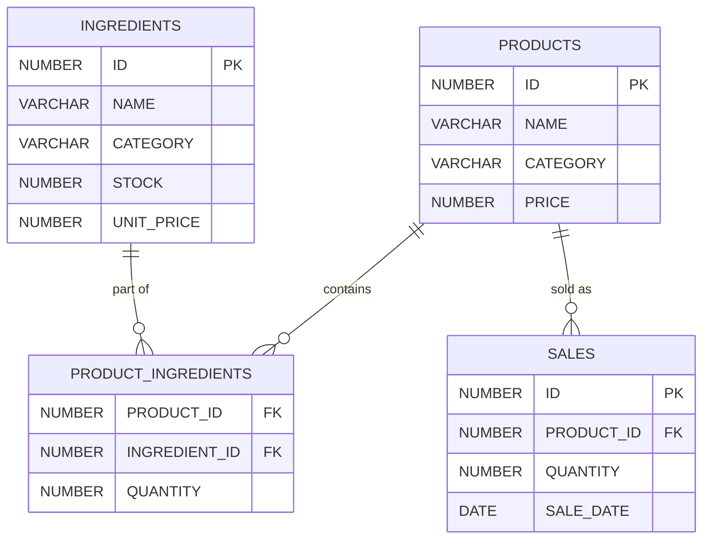

# 매장관리 프로그램 기획서

## 1. 프로젝트 개요

### 주요 기능

- **메뉴 관리**:
  - 상품 조회, 수정, 삭제, 추가
  - 각 상품의 카테고리, 재료 구성 관리
- **재고 관리**:
  - 재고 조회, 수정, 주문
  - 재료 소진 및 재고 반영
- **보고서**:
  - 매출, 소진 보고서, 판매 현황

## 2. DB 관련 설계

### 테이블 구조

#### PRODUCTS (상품 정보)

상품의 기본 정보를 저장

```sql
CREATE TABLE PRODUCTS (
    ID NUMBER PRIMARY KEY,
    NAME VARCHAR2(100) NOT NULL,
    CATEGORY VARCHAR2(50),
    PRICE NUMBER NOT NULL
);

CREATE SEQUENCE PRODUCT_SEQ
START WITH 1
INCREMENT BY 1
NOCACHE;
```

#### PRODUCT_INGREDIENTS (상품 재료 정보)

상품별로 소모되는 재료 정보를 정의

```sql
CREATE TABLE PRODUCT_INGREDIENTS (
    PRODUCT_ID NUMBER REFERENCES PRODUCTS(ID) ON DELETE CASCADE,
    INGREDIENT_ID NUMBER REFERENCES INGREDIENTS(ID) ON DELETE CASCADE,
    QUANTITY NUMBER NOT NULL,
    PRIMARY KEY (PRODUCT_ID, INGREDIENT_ID)
);
```

#### INGREDIENTS (재료 정보)

재료의 기본 정보 및 보유량을 저장

```sql
CREATE TABLE INGREDIENTS (
    ID NUMBER PRIMARY KEY,
    NAME VARCHAR2(100) NOT NULL,
    CATEGORY VARCHAR2(50),
    STOCK NUMBER NOT NULL,
    UNIT_PRICE NUMBER NOT NULL
);

CREATE SEQUENCE INGREDIENT_SEQ
START WITH 1
INCREMENT BY 1
NOCACHE;
```

#### SALES (판매 이력)

키오스크에서 발생한 판매 데이터를 기록

```sql
CREATE TABLE SALES (
    ID NUMBER PRIMARY KEY,
    PRODUCT_ID NUMBER REFERENCES PRODUCTS(ID),
    QUANTITY NUMBER NOT NULL,
    SALE_DATE DATE DEFAULT SYSDATE
);
```

### 삭제 쿼리문

```sql
-- 테이블 삭제
DROP TABLE PRODUCTS CASCADE CONSTRAINTS;
DROP TABLE INGREDIENTS CASCADE CONSTRAINTS;
DROP TABLE PRODUCT_INGREDIENTS CASCADE CONSTRAINTS;
DROP TABLE SALES CASCADE CONSTRAINTS;

-- 시퀀스 삭제
DROP SEQUENCE PRODUCT_SEQ;
DROP SEQUENCE INGREDIENT_SEQ;
```

## 3. 로직 설계

### 상품 등록 로직

등록된 상품은 `PRODUCTS`와 `PRODUCT_INGREDIENTS`에 저장. 재료와 소모량은 상품 등록 시 정의.

```java
public void addProduct(String name, String category, double price, Map<Integer, Integer> ingredients) {
    String productSql = "INSERT INTO PRODUCTS (ID, NAME, CATEGORY, PRICE) VALUES (PRODUCT_SEQ.NEXTVAL, ?, ?, ?)";
    String ingredientSql = "INSERT INTO PRODUCT_INGREDIENTS (PRODUCT_ID, INGREDIENT_ID, QUANTITY) VALUES (PRODUCT_SEQ.CURRVAL, ?, ?)";

    try (Connection conn = DBConnection.getConnection();
         PreparedStatement productStmt = conn.prepareStatement(productSql);
         PreparedStatement ingredientStmt = conn.prepareStatement(ingredientSql)) {

        // 상품 정보 저장
        productStmt.setString(1, name);
        productStmt.setString(2, category);
        productStmt.setDouble(3, price);
        productStmt.executeUpdate();

        // 재료 정보 저장
        for (Map.Entry<Integer, Integer> entry : ingredients.entrySet()) {
            ingredientStmt.setInt(1, entry.getKey());
            ingredientStmt.setInt(2, entry.getValue());
            ingredientStmt.addBatch();
        }
        ingredientStmt.executeBatch();

    } catch (SQLException e) {
        e.printStackTrace();
    }
}
```

### 판매 로직

판매 시, 판매된 상품 ID와 수량을 기반으로 `PRODUCT_INGREDIENTS`를 조회하고, 각 재료의 소모량을 계산하여 `INGREDIENTS.STOCK`에서 차감. 판매 데이터는 `SALES` 테이블에 기록.

```java
public void processSale(int productId, int quantity) {
    String salesSql = "INSERT INTO SALES (ID, PRODUCT_ID, QUANTITY, SALE_DATE) VALUES (SALES_SEQ.NEXTVAL, ?, ?, SYSDATE)";
    String ingredientSql = "SELECT INGREDIENT_ID, QUANTITY FROM PRODUCT_INGREDIENTS WHERE PRODUCT_ID = ?";
    String updateStockSql = "UPDATE INGREDIENTS SET STOCK = STOCK - ? WHERE ID = ?";

    try (Connection conn = DBConnection.getConnection();
         PreparedStatement salesStmt = conn.prepareStatement(salesSql);
         PreparedStatement ingredientStmt = conn.prepareStatement(ingredientSql);
         PreparedStatement updateStockStmt = conn.prepareStatement(updateStockSql)) {

        // 판매 데이터 기록
        salesStmt.setInt(1, productId);
        salesStmt.setInt(2, quantity);
        salesStmt.executeUpdate();

        // 재료 소모량 계산
        ingredientStmt.setInt(1, productId);
        ResultSet rs = ingredientStmt.executeQuery();
        while (rs.next()) {
            int ingredientId = rs.getInt("INGREDIENT_ID");
            int ingredientQuantity = rs.getInt("QUANTITY") * quantity;

            // 재료 재고 차감
            updateStockStmt.setInt(1, ingredientQuantity);
            updateStockStmt.setInt(2, ingredientId);
            updateStockStmt.addBatch();
        }
        updateStockStmt.executeBatch();

    } catch (SQLException e) {
        e.printStackTrace();
    }
}
```

## 4. ERD 다이어그램
- PRODUCTS와 PRODUCT_INGREDIENTS: 1:N 관계
 하나의 제품은 여러 재료를 포함할 수 있음    

- INGREDIENTS와 PRODUCT_INGREDIENTS: 1:N 관계
 하나의 재료는 여러 제품에 사용될 수 있음

- PRODUCTS와 SALES: 1:N 관계
 하나의 제품은 여러 판매 기록을 가질 수 있음



    
