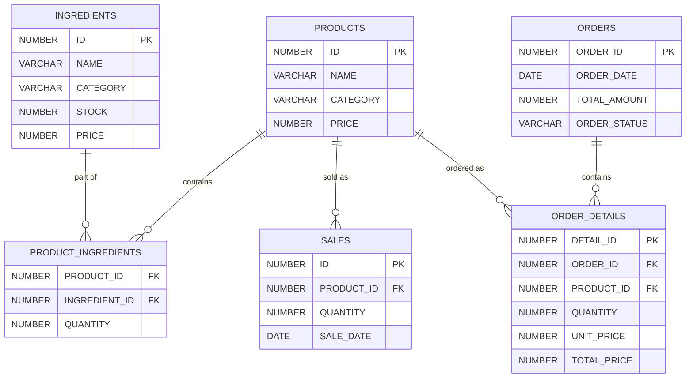

## **1. 테이블 설명**

### 1.1 **PRODUCTS (상품 테이블)**

- **역할**: 매장에서 판매되는 상품 정보를 저장.

- 주요 속성

  :

  - `ID`: 상품의 고유 번호 (기본 키).
  - `NAME`: 상품명.
  - `CATEGORY`: 상품 카테고리.
  - `PRICE`: 상품 가격.

------

### 1.2 **INGREDIENTS (재료 테이블)**

- **역할**: 상품을 만들 때 사용하는 재료 정보를 저장.

- 주요 속성

  :

  - `ID`: 재료의 고유 번호 (기본 키).
  - `NAME`: 재료명.
  - `CATEGORY`: 재료 카테고리.
  - `STOCK`: 재료의 현재 보유량.
  - `PRICE`: 재료 단가.

------

### 1.3 **PRODUCT_INGREDIENTS (상품-재료 매핑 테이블)**

- **역할**: 상품 제작 시 사용되는 재료와 소모량을 정의.

- 주요 속성

  :

  - `PRODUCT_ID`: 관련 상품의 ID (외래 키).
  - `INGREDIENT_ID`: 관련 재료의 ID (외래 키).
  - `QUANTITY`: 해당 상품을 만들 때 소모되는 재료의 양.

- 관계

  :

  - **PRODUCTS와 1:N 관계**: 하나의 상품은 여러 재료를 포함할 수 있음.
  - **INGREDIENTS와 1:N 관계**: 하나의 재료는 여러 상품에 사용될 수 있음.

------

### 1.4 **SALES (판매 테이블)**

- **역할**: 판매 내역을 기록.

- 주요 속성

  :

  - `ID`: 판매 기록의 고유 번호 (기본 키).
  - `PRODUCT_ID`: 판매된 상품의 ID (외래 키).
  - `QUANTITY`: 판매된 상품의 수량.
  - `SALE_DATE`: 판매 날짜.

- 관계

  :

  - **PRODUCTS와 1:N 관계**: 하나의 상품은 여러 판매 기록을 가질 수 있음.

------

### 1.5 **ORDERS (주문 테이블)**

- **역할**: 고객 주문 정보를 저장.

- 주요 속성

  :

  - `ORDER_ID`: 주문 고유 번호 (기본 키).
  - `ORDER_DATE`: 주문 날짜.
  - `TOTAL_AMOUNT`: 주문의 총 금액.
  - `ORDER_STATUS`: 주문 상태 (예: "처리 중", "완료").

- 관계

  :

  - **ORDER_DETAILS와 1:N 관계**: 하나의 주문은 여러 상품을 포함할 수 있음.

------

### 1.6 **ORDER_DETAILS (주문 상세 테이블)**

- **역할**: 주문에 포함된 상품과 수량, 가격 정보를 저장.

- 주요 속성

  :

  - `DETAIL_ID`: 주문 상세 고유 번호 (기본 키).
  - `ORDER_ID`: 관련 주문의 ID (외래 키).
  - `PRODUCT_ID`: 관련 상품의 ID (외래 키).
  - `QUANTITY`: 주문된 상품의 수량.
  - `UNIT_PRICE`: 상품 단가.
  - `TOTAL_PRICE`: 상품별 총 가격 (단가 × 수량).

- 관계

  :

  - **ORDERS와 1:N 관계**: 하나의 주문은 여러 상품 상세를 포함.
  - **PRODUCTS와 1:N 관계**: 하나의 상품은 여러 주문 상세에 포함될 수 있음.

------

## **2. 관계 설명**

### 2.1 상품과 재료 관계

- PRODUCTS와 PRODUCT_INGREDIENTS (1:N)
  - 하나의 상품은 여러 재료를 필요로 함.
- INGREDIENTS와 PRODUCT_INGREDIENTS (1:N)
  - 하나의 재료는 여러 상품에 사용될 수 있음.

### 2.2 상품과 판매 관계

- PRODUCTS와 SALES (1:N)
  - 하나의 상품은 여러 번 판매될 수 있음.

### 2.3 주문과 상세 정보 관계

- ORDERS와 ORDER_DETAILS (1:N)
  - 하나의 주문은 여러 상품 상세 정보를 포함.
- PRODUCTS와 ORDER_DETAILS (1:N)
  - 하나의 상품은 여러 주문에 포함될 수 있음.

------

## **3. 한국어 기반 구조 예제**

```plaintext

1. 상품(Product): 
   - 상품 정보 (예: '치즈버거', '더블 치즈버거')와 관련된 모든 속성 저장.

2. 재료(Ingredient): 
   - 상품 제작 시 필요한 재료 정보 (예: '소고기 패티', '치즈', '빵', '양상추') 관리.

3. 상품-재료 매핑(Product_Ingredients):
   - 상품에 사용되는 재료와 소모량 매핑. 
   - 예: 치즈버거 = 소고기 패티 1개, 치즈 1장, 빵 1개, 양상추 10g.

4. 판매(Sales): 
   - 특정 상품의 판매 내역 관리. 예: 치즈버거 3개 판매.

5. 주문(Orders): 
   - 고객의 주문 단위를 기록. 예: "주문 #1"에 치즈버거 3개, 더블 치즈버거 2개.

6. 주문 상세(Order_Details):
   - 주문과 각 상품의 매핑 정보. 예: 주문 #1은 치즈버거 3개(15,000원) 포함.

```

------

## **4. 활용 예시**

### 4.1 상품 등록 시

- **상품 테이블**에 상품 정보 저장.
- **상품-재료 매핑 테이블**에 해당 상품이 사용하는 재료와 소모량 등록.

### 4.2 판매 발생 시

- **판매 테이블**에 판매 기록 저장.

- 재고 관리

  :

  - `PRODUCT_INGREDIENTS`에서 소모량 확인.
  - `INGREDIENTS.STOCK`에서 차감.

### 4.3 주문 처리 시

- **주문 테이블**에 주문 정보 저장.
- **주문 상세 테이블**에 상품별 수량과 가격 정보 저장.
