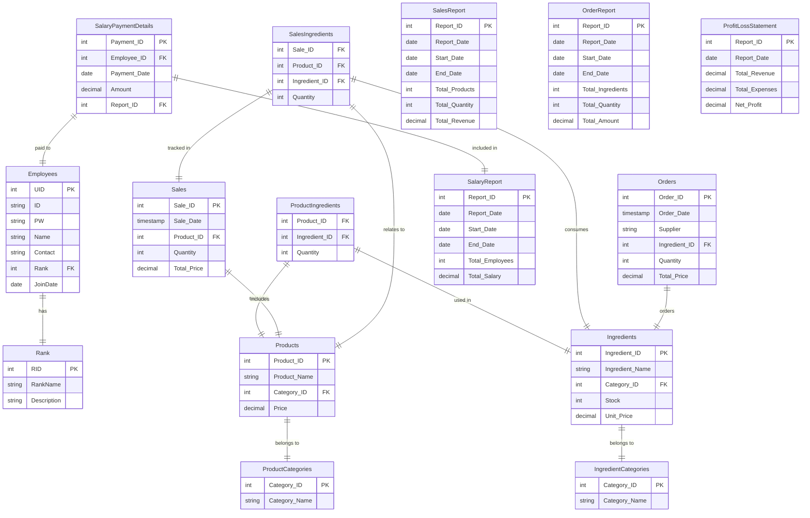

### 프로그램 구조 및 DB 테이블 설계

-----



#### 1. **직원 회원가입 및 로그인**

- **직원 테이블**:
  - **UID**: 고유 ID (Primary Key)
  - **ID**: 사용자 아이디
  - **PW**: 해시화된 비밀번호
  - **이름**: 사용자 이름
  - **연락처**: 전화번호
  - **직급**: 직급을 나타내는 외래키 (직급 테이블 참조)
  - **입사일**: 급여 계산에 필요
- **직급 테이블**:
  - **RANKID**: 직급 고유 ID (Primary Key)
  - **직급**: 직급 이름 (예: 1: 크루, 2: 팀리더, 3: 매니저)
  - **설명**: 직급에 대한 설명 (예: "매니저는 보고서 메뉴를 볼 수 있다")

**목표**: 로그인 후 직급에 따라 메뉴에 대한 접근 제한을 설정하고, 관리자 기능을 할 수 있도록 직급에 따른 권한을 설정.

------

#### 2. **재료 관리**

- **재료 테이블**:
  - **재료 ID** (Primary Key)
  - **재료 이름**
  - **재료 카테고리** (Foreign Key: 재료 카테고리 테이블 참조)
  - **수량**: 현재 재고 수량
  - **단가**: 재료 단가
- **재료 카테고리 테이블**:
  - **재료 카테고리 ID** (Primary Key)
  - **재료 카테고리 이름**
- **주문 테이블** (재료 주문을 기록):
  - **주문 ID** (Primary Key)
  - **주문 일시**
  - **거래처**: 재료를 구매한 상호 (예: "ㅇㅇ 상회")
  - **주문 재료** (재료 테이블과 연결된 외래키)
  - **주문 수량**
  - **총 주문 금액**

**목표**: 재료를 등록하고, 재료의 수량을 관리하며, 재고 소진 시 자동으로 주문할 수 있도록 함.

------

#### 3. **상품 관리**

- **상품 테이블**:
  - **상품 ID** (Primary Key)
  - **상품 이름**
  - **상품 카테고리** (Foreign Key: 상품 카테고리 테이블 참조)
  - **가격**
- **상품 카테고리 테이블**:
  - **상품 카테고리 ID** (Primary Key)
  - **상품 카테고리 이름**
- **상품-재료 관계 테이블** (상품과 재료 관계 관리):
  - **상품 ID** (Foreign Key: 상품 테이블)
  - **재료 ID** (Foreign Key: 재료 테이블)
  - **수량**: 해당 상품을 만드는 데 필요한 재료의 수량

**목표**: 상품을 등록하고, 상품에 필요한 재료를 지정하며, 판매 시 해당 재료가 소모되는 관계를 관리.

------

#### 4. **판매 관리**

- **판매 테이블**:
  - **판매 ID** (Primary Key)
  - **판매 일시**
  - **상품 ID** (Foreign Key: 상품 테이블)
  - **판매 수량**
  - **총 판매 금액**
- **상품 판매 시 재료 소모 관계 테이블**:
  - **판매 ID** (Foreign Key: 판매 테이블)
  - **상품 ID** (Foreign Key: 상품 테이블)
  - **재료 ID** (Foreign Key: 재료 테이블)
  - **소모 수량**

**목표**: 상품 판매 시, 판매된 상품에 필요한 재료의 수량이 소모되고, 재고에서 차감되는 기능을 구현.

------

#### 5. **보고서 관리**

- **매출 보고서**:
  - **매출 보고서 ID** (Primary Key)
  - **매출 보고서 날짜**
  - **시작일**
  - **종료일**
  - **총 판매 상품 수**: 판매된 상품의 고유 종류 수
  - **총 판매 수량**: 판매된 총 상품 수량
  - **총 매출 금액**: 해당 기간 동안 발생한 총 매출
- **주문 보고서**:
  - **주문 보고서 ID** (Primary Key)
  - **주문 보고서 날짜**
  - **시작일**
  - **종료일**
  - **총 주문 재료 수**: 주문된 재료의 고유 종류 수
  - **총 주문 수량**: 주문된 총 재료 수량
  - **총 주문 금액**: 해당 기간 동안 주문된 총 재료 금액
- **급여 보고서**:
  - **급여 보고서 ID** (Primary Key)
  - **급여 보고서 날짜**
  - **시작일**
  - **종료일**
  - **총 급여 지급 직원 수**
  - **총 급여 지급 금액**
- **급여 지급 내역**:
  - **급여 지급 내역 ID** (Primary Key)
  - **직원 ID** (Foreign Key: 직원 테이블)
  - **급여 지급일**
  - **급여 금액**
  - **급여 보고서 ID** (Foreign Key: 급여 보고서 테이블)
- **매장 손익 계산서**:
  - **손익 계산서 ID** (Primary Key)
  - **시작일**
  - **종료일**
  - **총 매출**
  - **총 비용**
  - **순이익**

**목표**: 매출 보고서, 주문 보고서, 급여 보고서, 그리고 매장 손익 계산서를 생성하여 매출, 비용, 급여 등을 관리할 수 있도록 함.


------
# DB 테이블 설명 및 쿼리
### 1. **직원 테이블 (Employees)**

| **컬럼명** | **타입**     | **설명**                             |
| ---------- | ------------ | ------------------------------------ |
| `UID`      | INT (PK)     | 고유 직원 ID                       |
| `ID`       | VARCHAR(255) | 직원 아이디                        |
| `PW`       | VARCHAR(255) | 해시화된 비밀번호                    |
| `이름`     | VARCHAR(255) | 직원 이름                          |
| `연락처`   | VARCHAR(255) | 직원 연락처                        |
| `직급`     | INT (FK)     | 직급 (1: 크루, 2: 팀리더, 3: 매니저) |
| `입사일`   | DATE         | 입사일 (급여 계산에 필요)            |

```sql
CREATE TABLE Employees (
    UID INT PRIMARY KEY,
    ID VARCHAR(255) NOT NULL,
    PW VARCHAR(255) NOT NULL,
    Name VARCHAR(255) NOT NULL,
    Contact VARCHAR(255) NOT NULL,
    Rank INT, -- 직급 (1: 크루, 2: 팀리더, 3: 매니저)
    JoinDate DATE,
    FOREIGN KEY (Rank) REFERENCES Rank(LID)
);
```

------

### 2. **직급 테이블 (Rank)**

| **컬럼명** | **타입**     | **설명**                             |
| ---------- | ------------ | ------------------------------------ |
| `LID`      | INT (PK)     | 직급 ID                              |
| `직급`     | VARCHAR(255) | 직급 이름 (예: 크루, 팀리더, 매니저) |
| `설명`     | TEXT         | 직급 설명 (직급에 대한 설명)         |

```sql
CREATE TABLE Rank (
    LID INT PRIMARY KEY,
    RankName VARCHAR(255) NOT NULL,
    Description TEXT
);
```

------

### 3. **재료 테이블 (Ingredients)**

| **컬럼명**        | **타입**       | **설명**                                  |
| ----------------- | -------------- | ----------------------------------------- |
| `Ingredient_ID`   | INT (PK)       | 재료 ID                                   |
| `Ingredient_Name` | VARCHAR(255)   | 재료 이름                                 |
| `Category_ID`     | INT (FK)       | 재료 카테고리 (재료 카테고리 테이블 참조) |
| `Stock`           | INT            | 재고 수량                                 |
| `Unit_Price`      | DECIMAL(10, 2) | 재료 단가                                 |

```sql
CREATE TABLE Ingredients (
    Ingredient_ID INT PRIMARY KEY,
    Ingredient_Name VARCHAR(255) NOT NULL,
    Category_ID INT, -- 재료 카테고리 (재료 카테고리 테이블 참조)
    Stock INT NOT NULL,
    Unit_Price DECIMAL(10, 2) NOT NULL,
    FOREIGN KEY (Category_ID) REFERENCES IngredientCategories(Category_ID)
);
```

------

### 4. **재료 카테고리 테이블 (IngredientCategories)**

| **컬럼명**      | **타입**     | **설명**      |
| --------------- | ------------ | ------------- |
| `Category_ID`   | INT (PK)     | 카테고리 ID   |
| `Category_Name` | VARCHAR(255) | 카테고리 이름 |

```sql
CREATE TABLE IngredientCategories (
    Category_ID INT PRIMARY KEY,
    Category_Name VARCHAR(255) NOT NULL
);
```

------

### 5. **상품 테이블 (Products)**

| **컬럼명**     | **타입**       | **설명**                                  |
| -------------- | -------------- | ----------------------------------------- |
| `Product_ID`   | INT (PK)       | 상품 ID                                   |
| `Product_Name` | VARCHAR(255)   | 상품 이름                                 |
| `Category_ID`  | INT (FK)       | 상품 카테고리 (상품 카테고리 테이블 참조) |
| `Price`        | DECIMAL(10, 2) | 상품 가격                                 |

```
CREATE TABLE Products (
    Product_ID INT PRIMARY KEY,
    Product_Name VARCHAR(255) NOT NULL,
    Category_ID INT, -- 상품 카테고리 (상품 카테고리 테이블 참조)
    Price DECIMAL(10, 2) NOT NULL,
    FOREIGN KEY (Category_ID) REFERENCES ProductCategories(Category_ID)
);
```

------

### 6. **상품 카테고리 테이블 (ProductCategories)**

| **컬럼명**      | **타입**     | **설명**      |
| --------------- | ------------ | ------------- |
| `Category_ID`   | INT (PK)     | 카테고리 ID   |
| `Category_Name` | VARCHAR(255) | 카테고리 이름 |

```sql
CREATE TABLE ProductCategories (
    Category_ID INT PRIMARY KEY,
    Category_Name VARCHAR(255) NOT NULL
);
```

------

### 7. **상품-재료 관계 테이블 (ProductIngredients)**

| **컬럼명**      | **타입** | **설명**                   |
| --------------- | -------- | -------------------------- |
| `Product_ID`    | INT (FK) | 상품 ID (상품 테이블 참조) |
| `Ingredient_ID` | INT (FK) | 재료 ID (재료 테이블 참조) |
| `Quantity`      | INT      | 재료 수량                  |

```sql
CREATE TABLE ProductIngredients (
    Product_ID INT,
    Ingredient_ID INT,
    Quantity INT NOT NULL,
    PRIMARY KEY (Product_ID, Ingredient_ID),
    FOREIGN KEY (Product_ID) REFERENCES Products(Product_ID),
    FOREIGN KEY (Ingredient_ID) REFERENCES Ingredients(Ingredient_ID)
);
```

------

### 8. **판매 테이블 (Sales)**

| **컬럼명**    | **타입**       | **설명**                          |
| ------------- | -------------- | --------------------------------- |
| `Sale_ID`     | INT (PK)       | 판매 ID                           |
| `Sale_Date`   | TIMESTAMP      | 판매 일시                         |
| `Product_ID`  | INT (FK)       | 판매된 상품 ID (상품 테이블 참조) |
| `Quantity`    | INT            | 판매 수량                         |
| `Total_Price` | DECIMAL(10, 2) | 총 판매 금액                      |

```sql
CREATE TABLE Sales (
    Sale_ID INT PRIMARY KEY,
    Sale_Date TIMESTAMP DEFAULT CURRENT_TIMESTAMP,
    Product_ID INT,
    Quantity INT NOT NULL,
    Total_Price DECIMAL(10, 2) NOT NULL,
    FOREIGN KEY (Product_ID) REFERENCES Products(Product_ID)
);
```

------

### 9. **주문 테이블 (Orders)**

| **컬럼명**      | **타입**       | **설명**                          |
| --------------- | -------------- | --------------------------------- |
| `Order_ID`      | INT (PK)       | 주문 ID                           |
| `Order_Date`    | TIMESTAMP      | 주문 일시                         |
| `Supplier`      | VARCHAR(255)   | 거래처 (예: ㅇㅇ 상회)            |
| `Ingredient_ID` | INT (FK)       | 주문된 재료 ID (재료 테이블 참조) |
| `Quantity`      | INT            | 주문된 재료 수량                  |
| `Total_Price`   | DECIMAL(10, 2) | 총 주문 금액                      |

```sql
CREATE TABLE Orders (
    Order_ID INT PRIMARY KEY,
    Order_Date TIMESTAMP DEFAULT CURRENT_TIMESTAMP,
    Supplier VARCHAR(255),
    Ingredient_ID INT,
    Quantity INT NOT NULL,
    Total_Price DECIMAL(10, 2) NOT NULL,
    FOREIGN KEY (Ingredient_ID) REFERENCES Ingredients(Ingredient_ID)
);
```

------

### 10. **상품 판매 시 재료 소모 관계 테이블 (SalesIngredients)**

| **컬럼명**      | **타입** | **설명**                          |
| --------------- | -------- | --------------------------------- |
| `Sale_ID`       | INT (FK) | 판매 ID (판매 테이블 참조)        |
| `Product_ID`    | INT (FK) | 상품 ID (상품 테이블 참조)        |
| `Ingredient_ID` | INT (FK) | 소모된 재료 ID (재료 테이블 참조) |
| `Quantity`      | INT      | 소모된 재료 수량                  |

```sql
CREATE TABLE SalesIngredients (
    Sale_ID INT,
    Product_ID INT,
    Ingredient_ID INT,
    Quantity INT NOT NULL,
    PRIMARY KEY (Sale_ID, Product_ID, Ingredient_ID),
    FOREIGN KEY (Sale_ID) REFERENCES Sales(Sale_ID),
    FOREIGN KEY (Product_ID) REFERENCES Products(Product_ID),
    FOREIGN KEY (Ingredient_ID) REFERENCES Ingredients(Ingredient_ID)
);
```

------

### 11. **매출 보고서 테이블 (SalesReport)**

| **컬럼명**       | **타입**       | **설명**                   |
| ---------------- | -------------- | -------------------------- |
| `Report_ID`      | INT (PK)       | 보고서 ID                  |
| `Report_Date`    | DATE           | 보고서 날짜                |
| `Start_Date`     | DATE           | 보고서 시작일              |
| `End_Date`       | DATE           | 보고서 종료일              |
| `Total_Products` | INT            | 판매된 상품의 고유 종류 수 |
| `Total_Quantity` | INT            | 판매된 총 수량             |
| `Total_Revenue`  | DECIMAL(10, 2) | 총 매출 금액               |

```sql
CREATE TABLE SalesReport (
    Report_ID INT PRIMARY KEY,
    Report_Date DATE,
    Start_Date DATE,
    End_Date DATE,
    Total_Products INT,
    Total_Quantity INT,
    Total_Revenue DECIMAL(10, 2)
);
```

------

### 12. **주문 보고서 테이블 (OrderReport)**

| **컬럼명**          | **타입**       | **설명**                   |
| ------------------- | -------------- | -------------------------- |
| `Report_ID`         | INT (PK)       | 보고서 ID                  |
| `Report_Date`       | DATE           | 보고서 날짜                |
| `Start_Date`        | DATE           | 시작일                     |
| `End_Date`          | DATE           | 종료일                     |
| `Total_Ingredients` | INT            | 주문된 재료의 고유 종류 수 |
| `Total_Quantity`    | INT            | 주문된 총 수량             |
| `Total_Amount`      | DECIMAL(10, 2) | 총 주문 금액               |

```sql
CREATE TABLE OrderReport (
    Report_ID INT PRIMARY KEY,
    Report_Date DATE,
    Start_Date DATE,
    End_Date DATE,
    Total_Ingredients INT,
    Total_Quantity INT,
    Total_Amount DECIMAL(10, 2)
);
```

------

### 13. **급여 지급 내역 테이블 (SalaryPaymentDetails)**

| **컬럼명**     | **타입**       | **설명**                                 |
| -------------- | -------------- | ---------------------------------------- |
| `Payment_ID`   | INT (PK)       | 급여 지급 ID                             |
| `Employee_ID`  | INT (FK)       | 직원 ID (직원 테이블 참조)               |
| `Payment_Date` | DATE           | 급여 지급일                              |
| `Amount`       | DECIMAL(10, 2) | 지급된 급여 금액                         |
| `Report_ID`    | INT (FK)       | 급여 보고서 ID (급여 보고서 테이블 참조) |

```sql
CREATE TABLE SalaryPaymentDetails (
    Payment_ID INT PRIMARY KEY,
    Employee_ID INT,
    Payment_Date DATE,
    Amount DECIMAL(10, 2),
    Report_ID INT,
    FOREIGN KEY (Employee_ID) REFERENCES Users(UID),
    FOREIGN KEY (Report_ID) REFERENCES SalaryReport(Report_ID)
);
```

------

### 14. **급여 보고서 테이블 (SalaryReport)**

| **컬럼명**        | **타입**       | **설명**                           |
| ----------------- | -------------- | ---------------------------------- |
| `Report_ID`       | INT (PK)       | 급여 보고서 ID                     |
| `Report_Date`     | DATE           | 보고서 작성일                      |
| `Start_Date`      | DATE           | 보고서 시작일                      |
| `End_Date`        | DATE           | 보고서 종료일                      |
| `Total_Employees` | INT            | 급여 지급 직원 수                  |
| `Total_Salary`    | DECIMAL(10, 2) | 해당 기간 동안 지급된 총 급여 금액 |

```sql
CREATE TABLE SalaryReport (
    Report_ID INT PRIMARY KEY,
    Report_Date DATE,
    Start_Date DATE,
    End_Date DATE,
    Total_Employees INT,
    Total_Salary DECIMAL(10, 2)
);
```

------

### **15.매장 손익 계산서 테이블 (ProfitLossStatement)**

| **컬럼명**                | **타입**       | **설명**                  |
| ------------------------- | -------------- | ------------------------- |
| `profit_and_loss_id` (PK) | INT            | 손익 계산서 ID (기본 키)  |
| `start_date`              | DATE           | 손익 계산서 기간 시작일   |
| `end_date`                | DATE           | 손익 계산서 기간 종료일   |
| `total_revenue`           | DECIMAL(10, 2) | 총 매출 (판매 금액 합계)  |
| `total_expenses`          | DECIMAL(10, 2) | 총 비용 (주문 및 급여 등) |
| `net_profit`              | DECIMAL(10, 2) | 순이익 (매출 - 비용)      |

```sql
CREATE TABLE ProfitLossStatement (
    Report_ID INT PRIMARY KEY,
    Report_Date DATE,
    Total_Revenue DECIMAL(10, 2),
    Total_Expenses DECIMAL(10, 2),
    Net_Profit DECIMAL(10, 2)
);
```


------


```sql
-- 시퀀스 생성
CREATE SEQUENCE seq_rank_id START WITH 1 INCREMENT BY 1;
CREATE SEQUENCE seq_employee_id START WITH 1 INCREMENT BY 1;
CREATE SEQUENCE seq_ingredient_id START WITH 1 INCREMENT BY 1;
CREATE SEQUENCE seq_product_id START WITH 1 INCREMENT BY 1;
CREATE SEQUENCE seq_sale_id START WITH 1 INCREMENT BY 1;
CREATE SEQUENCE seq_order_id START WITH 1 INCREMENT BY 1;
CREATE SEQUENCE seq_payment_id START WITH 1 INCREMENT BY 1;
CREATE SEQUENCE seq_report_id START WITH 1 INCREMENT BY 1;

-- Rank 테이블 생성
CREATE TABLE Rank (
    RID INT PRIMARY KEY,
    RankName VARCHAR(255) NOT NULL,
    Description VARCHAR2(255)
);

-- Employees 테이블 생성
CREATE TABLE Employees (
    EID INT PRIMARY KEY,
    ID VARCHAR(255) NOT NULL,
    PW VARCHAR(255) NOT NULL,
    Name VARCHAR(255) NOT NULL,
    Contact VARCHAR(255) NOT NULL,
    Rank INT,
    JoinDate DATE,
    FOREIGN KEY (Rank) REFERENCES Rank(RID)
);

-- IngredientCategories 테이블 생성
CREATE TABLE IngredientCategories (
    Category_ID INT PRIMARY KEY,
    Category_Name VARCHAR(255) NOT NULL
);

-- Ingredients 테이블 생성
CREATE TABLE Ingredients (
    Ingredient_ID INT PRIMARY KEY,
    Ingredient_Name VARCHAR(255) NOT NULL,
    Category_ID INT,
    Stock INT NOT NULL,
    Unit_Price DECIMAL(10, 2) NOT NULL,
    FOREIGN KEY (Category_ID) REFERENCES IngredientCategories(Category_ID)
);

-- ProductCategories 테이블 생성
CREATE TABLE ProductCategories (
    Category_ID INT PRIMARY KEY,
    Category_Name VARCHAR(255) NOT NULL
);

-- Products 테이블 생성
CREATE TABLE Products (
    Product_ID INT PRIMARY KEY,
    Product_Name VARCHAR(255) NOT NULL,
    Category_ID INT,
    Price DECIMAL(10, 2) NOT NULL,
    FOREIGN KEY (Category_ID) REFERENCES ProductCategories(Category_ID)
);

-- ProductIngredients 테이블 생성
CREATE TABLE ProductIngredients (
    Product_ID INT,
    Ingredient_ID INT,
    Quantity INT NOT NULL,
    PRIMARY KEY (Product_ID, Ingredient_ID),
    FOREIGN KEY (Product_ID) REFERENCES Products(Product_ID),
    FOREIGN KEY (Ingredient_ID) REFERENCES Ingredients(Ingredient_ID)
);

-- Sales 테이블 생성
CREATE TABLE Sales (
    Sale_ID INT PRIMARY KEY,
    Sale_Date TIMESTAMP DEFAULT CURRENT_TIMESTAMP,
    Product_ID INT,
    Quantity INT NOT NULL,
    Total_Price DECIMAL(10, 2) NOT NULL,
    FOREIGN KEY (Product_ID) REFERENCES Products(Product_ID)
);

-- SalesIngredients 테이블 생성
CREATE TABLE SalesIngredients (
    Sale_ID INT,
    Product_ID INT,
    Ingredient_ID INT,
    Quantity INT NOT NULL,
    PRIMARY KEY (Sale_ID, Product_ID, Ingredient_ID),
    FOREIGN KEY (Sale_ID) REFERENCES Sales(Sale_ID),
    FOREIGN KEY (Product_ID) REFERENCES Products(Product_ID),
    FOREIGN KEY (Ingredient_ID) REFERENCES Ingredients(Ingredient_ID)
);

-- Orders 테이블 생성
CREATE TABLE Orders (
    Order_ID INT PRIMARY KEY,
    Order_Date TIMESTAMP DEFAULT CURRENT_TIMESTAMP,
    Supplier VARCHAR(255),
    Ingredient_ID INT,
    Quantity INT NOT NULL,
    Total_Price DECIMAL(10, 2) NOT NULL,
    FOREIGN KEY (Ingredient_ID) REFERENCES Ingredients(Ingredient_ID)
);

-- SalaryPaymentDetails 테이블 생성
CREATE TABLE SalaryPaymentDetails (
    Payment_ID INT PRIMARY KEY,
    Employee_ID INT,
    Payment_Date DATE,
    Amount DECIMAL(10, 2),
    Report_ID INT,
    FOREIGN KEY (Employee_ID) REFERENCES Employees(EID),
    FOREIGN KEY (Report_ID) REFERENCES SalaryReport(Report_ID)
);

-- SalaryReport 테이블 생성
CREATE TABLE SalaryReport (
    Report_ID INT PRIMARY KEY,
    Report_Date DATE,
    Start_Date DATE,
    End_Date DATE,
    Total_Employees INT,
    Total_Salary DECIMAL(10, 2)
);

-- SalesReport 테이블 생성
CREATE TABLE SalesReport (
    Report_ID INT PRIMARY KEY,
    Report_Date DATE,
    Start_Date DATE,
    End_Date DATE,
    Total_Products INT,
    Total_Quantity INT,
    Total_Revenue DECIMAL(10, 2)
);

-- OrderReport 테이블 생성
CREATE TABLE OrderReport (
    Report_ID INT PRIMARY KEY,
    Report_Date DATE,
    Start_Date DATE,
    End_Date DATE,
    Total_Ingredients INT,
    Total_Quantity INT,
    Total_Amount DECIMAL(10, 2)
);

-- ProfitLossStatement 테이블 생성
CREATE TABLE ProfitLossStatement (
    Report_ID INT PRIMARY KEY,
    Report_Date DATE,
    Total_Revenue DECIMAL(10, 2),
    Total_Expenses DECIMAL(10, 2),
    Net_Profit DECIMAL(10, 2)
);

-- 트리거 생성: Sales 테이블에 새로운 판매가 추가될 때 재고를 감소시키는 트리거
CREATE OR REPLACE TRIGGER trg_update_stock_after_sale
AFTER INSERT ON Sales
FOR EACH ROW
BEGIN
    UPDATE Ingredients
    SET Stock = Stock - :NEW.Quantity
    WHERE Ingredient_ID IN (
        SELECT Ingredient_ID
        FROM ProductIngredients
        WHERE Product_ID = :NEW.Product_ID
    );
END;

-- 샘플 데이터 삽입
INSERT INTO Rank (RID, RankName, Description) VALUES (seq_rank_id.NEXTVAL, '크루', '일반 직원');
INSERT INTO Employees (EID, ID, PW, Name, Contact, Rank, JoinDate) VALUES (seq_employee_id.NEXTVAL, 'employee1', 'hashedPassword', 'John Doe', '123-456-7890', 1, TO_DATE('2020-01-01', 'YYYY-MM-DD'));

```
