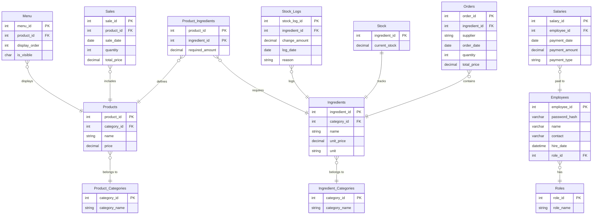

# **전체 테이블 구조**



--------

## 1. 테이블 구성
#### **1. 직원 테이블**

| 컬럼명          | 데이터 타입 | 설명              |
| --------------- | ----------- | ----------------- |
| `employee_id`   | INT (PK)    | 직원 ID           |
| `password_hash` | VARCHAR     | 암호화된 비밀번호 |
| `name`          | VARCHAR     | 직원 이름         |
| `contact`       | VARCHAR     | 직원 연락처       |
| `hire_date`     | DATETIME    | 입사 일자         |
| `role_id`       | INT (FK)    | 직급 ID           |

------

#### **2. 직급 테이블**

| 컬럼명      | 데이터 타입 | 설명                   |
| ----------- | ----------- | ---------------------- |
| `role_id`   | INT (PK)    | 직급 ID                |
| `role_name` | VARCHAR     | 직급명 (크루, 리더 등) |

------

#### **3. 재료 카테고리 테이블**

| 컬럼명          | 데이터 타입 | 설명               |
| --------------- | ----------- | ------------------ |
| `category_id`   | INT (PK)    | 재료 카테고리 ID   |
| `category_name` | VARCHAR     | 재료 카테고리 이름 |

------

#### **4. 재료 테이블**

| 컬럼명          | 데이터 타입 | 설명             |
| --------------- | ----------- | ---------------- |
| `ingredient_id` | INT (PK)    | 재료 ID          |
| `category_id`   | INT (FK)    | 재료 카테고리 ID |
| `name`          | VARCHAR     | 재료명           |
| `unit_price`    | DECIMAL     | 단가             |
| `unit`          | VARCHAR     | 단위 (예: g, 개) |

------

#### **5. 주문 테이블**

| 컬럼명          | 데이터 타입 | 설명         |
| --------------- | ----------- | ------------ |
| `order_id`      | INT (PK)    | 주문 ID      |
| `ingredient_id` | INT (FK)    | 재료 ID      |
| `supplier`      | VARCHAR     | 거래처       |
| `order_date`    | DATETIME    | 주문 일시    |
| `quantity`      | DECIMAL     | 주문 수량    |
| `total_price`   | DECIMAL     | 총 주문 금액 |

------

#### **6. 재고 테이블**

| 컬럼명          | 데이터 타입  | 설명        |
| --------------- | ------------ | ----------- |
| `ingredient_id` | INT (PK, FK) | 재료 ID     |
| `current_stock` | DECIMAL      | 현재 재고량 |

------

#### **7. 재고 기록 테이블**

| 컬럼명          | 데이터 타입 | 설명                     |
| --------------- | ----------- | ------------------------ |
| `stock_log_id`  | INT (PK)    | 재고 기록 ID             |
| `ingredient_id` | INT (FK)    | 재료 ID                  |
| `change_amount` | DECIMAL     | 변화량                   |
| `log_date`      | DATETIME    | 기록 날짜                |
| `reason`        | VARCHAR     | 변화 사유 (판매/주문 등) |

------

#### **8. 상품 카테고리 테이블**

| 컬럼명          | 데이터 타입 | 설명               |
| --------------- | ----------- | ------------------ |
| `category_id`   | INT (PK)    | 상품 카테고리 ID   |
| `category_name` | VARCHAR     | 상품 카테고리 이름 |

------

#### **9. 상품 테이블**

| 컬럼명        | 데이터 타입 | 설명             |
| ------------- | ----------- | ---------------- |
| `product_id`  | INT (PK)    | 상품 ID          |
| `category_id` | INT (FK)    | 상품 카테고리 ID |
| `name`        | VARCHAR     | 상품명           |
| `price`       | DECIMAL     | 상품 가격        |

------

#### **10. 상품_재료 매핑 테이블**

| 컬럼명            | 데이터 타입  | 설명    |
| ----------------- | ------------ | ------- |
| `product_id`      | INT (PK, FK) | 상품 ID |
| `ingredient_id`   | INT (PK, FK) | 재료 ID |
| `required_amount` | DECIMAL      | 소요량  |

------

#### **11. 판매 테이블**

| 컬럼명        | 데이터 타입 | 설명         |
| ------------- | ----------- | ------------ |
| `sale_id`     | INT (PK)    | 판매 ID      |
| `product_id`  | INT (FK)    | 상품 ID      |
| `sale_date`   | DATETIME    | 판매 일시    |
| `quantity`    | INT         | 판매 수량    |
| `total_price` | DECIMAL     | 총 판매 금액 |

------

#### **12. 급여 테이블**

| 컬럼명           | 데이터 타입 | 설명                        |
| ---------------- | ----------- | --------------------------- |
| `salary_id`      | INT (PK)    | 급여 ID                     |
| `employee_id`    | INT (FK)    | 직원 ID                     |
| `payment_date`   | DATETIME    | 급여 지급 날짜              |
| `payment_amount` | DECIMAL     | 급여 지급액                 |
| `payment_type`   | VARCHAR     | 급여 구분 (월급, 상여금 등) |

------

#### **13. 메뉴 테이블**

| 컬럼명          | 데이터 타입      | 설명                                     |
| --------------- | ---------------- | ---------------------------------------- |
| `menu_id`       | NUMBER (PK)      | Menu 테이블 고유 ID                     |
| `product_id`    | NUMBER (FK)      | Products 테이블의 상품 ID                |
| `display_order` | NUMBER           | 메뉴판에서 상품 표시 순서                |
| `is_visible`    | CHAR(1)          | 메뉴판 표시 여부 ('Y': 표시, 'N': 숨김)  |


------


## 2. 시퀀스와 트리거

### 1. 시퀀스를 활용할 테이블

#### **시퀀스 활용 테이블 목록**

1. 직원 테이블 (`Employees`)
   - `employee_id`: 고유 직원 식별자.
2. 직급 테이블 (`Roles`)
   - `role_id`: 직급 식별자.
3. 재료 테이블 (`Ingredients`)
   - `ingredient_id`: 고유 재료 식별자.
4. 재료 카테고리 테이블 (`Ingredient_Categories`)
   - `category_id`: 재료 카테고리 식별자.
5. 상품 테이블 (`Products`)
   - `product_id`: 고유 상품 식별자.
6. 상품 카테고리 테이블 (`Product_Categories`)
   - `category_id`: 상품 카테고리 식별자.
7. 주문 테이블 (`Orders`)
   - `order_id`: 고유 주문 기록 식별자.
8. 판매 테이블 (`Sales`)
   - `sale_id`: 고유 판매 기록 식별자.
9. 급여 테이블 (`Salaries`)
   - `salary_id`: 고유 급여 지급 기록 식별자.
10. 재고 기록 테이블 (`Stock_Logs`)
    - `stock_log_id`: 재고 변화 기록 식별자.

------

### **2. 트리거를 사용해야 할 테이블**

#### **트리거 활용 테이블 목록**

1. **재고 테이블 (`Stock`)**

   - 판매가 발생하면 재고량 감소.

   - 주문이 완료되면 재고량 증가.

     - 판매 후 재고 감소:

       ```sql
       AFTER INSERT ON Sales
       ```

     - 주문 후 재고 증가:

       ```sql
       AFTER INSERT ON Orders
       ```

2. **재고 기록 테이블 (`Stock_Logs`)**

   - 자동화 필요성.

   - 재고가 변경될 때마다 기록 생성.

     - 재고 변경 시 기록 추가:

       ```sql
       AFTER UPDATE ON Stock
       ```

3. **상품_재료 매핑 테이블 (`Product_Ingredients`)**

   - 판매 시 관련 재료와 소모량을 계산해 재고 테이블에 반영.

     - 판매 후 재료 소비량 계산:

       ```sql
       AFTER INSERT ON Sales
       ```

------

### **3. 시퀀스와 트리거 사용 구분**

| **테이블명**              | **시퀀스 사용 여부** | **트리거 사용 여부** | **트리거 활용 목적**                  |
| ------------------------- | -------------------- | -------------------- | ------------------------------------- |
| **직원 테이블**           | 시퀀스 사용          | 트리거 사용 안 함    |                                       |
| **직급 테이블**           | 시퀀스 사용          | 트리거 사용 안 함    |                                       |
| **재료 테이블**           | 시퀀스 사용          | 트리거 사용 안 함    |                                       |
| **재료 카테고리 테이블**  | 시퀀스 사용          | 트리거 사용 안 함    |                                       |
| **상품 테이블**           | 시퀀스 사용          | 트리거 사용 안 함    |                                       |
| **상품 카테고리 테이블**  | 시퀀스 사용          | 트리거 사용 안 함    |                                       |
| **주문 테이블**           | 시퀀스 사용          | 트리거 사용 안 함    |                                       |
| **판매 테이블**           | 시퀀스 사용          | 트리거 사용          | 판매 후 재고량 감소 처리              |
| **급여 테이블**           | 시퀀스 사용          | 트리거 사용 안 함    |                                       |
| **재고 테이블**           | 시퀀스 사용 안 함    | 트리거 사용          | 판매/주문에 따른 재고량 변화 처리     |
| **재고 기록 테이블**      | 시퀀스 사용          | 트리거 사용          | 재고 변화 시 자동 기록                |
| **상품_재료 매핑 테이블** | 시퀀스 사용 안 함    | 트리거 사용          | 판매 시 재료 소모량 계산 및 재고 반영 |


