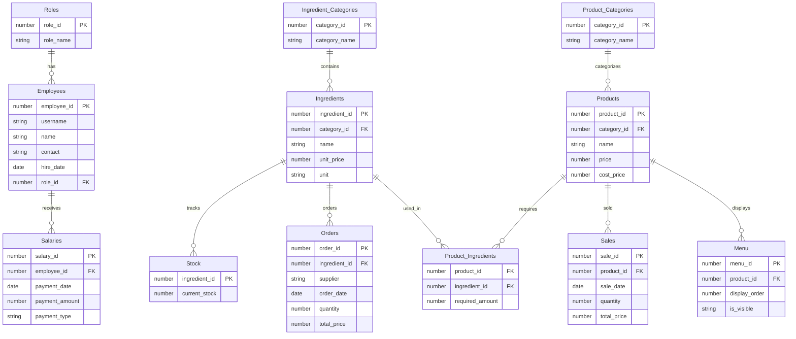

# Database 설계 및 쿼리 가이드
<br/>


<br/><br/>
## 1. 테이블 구성

#### **1. 직급 테이블 (Roles)**

| 컬럼명      | 데이터 타입 | 설명                   |
| ----------- | ----------- | ---------------------- |
| `role_id`   | INT (PK)    | 직급 ID                |
| `role_name` | VARCHAR     | 직급명 (크루, 리더 등) |

------

#### **2. 직원 테이블 (Employees)**

| 컬럼명          | 데이터 타입 | 설명              |
| --------------- | ----------- | ----------------- |
| `employee_id`   | INT (PK)    | 직원 ID           |
| `username`      | VARCHAR     | 사용자명          |
| `password_hash` | VARCHAR     | 암호화된 비밀번호 |
| `name`          | VARCHAR     | 직원 이름         |
| `contact`       | VARCHAR     | 직원 연락처       |
| `hire_date`     | DATETIME    | 입사 일자         |
| `role_id`       | INT (FK)    | 직급 ID           |

------

#### **3. 재료 카테고리 테이블 (Ingredient_Categories)**

| 컬럼명          | 데이터 타입 | 설명               |
| --------------- | ----------- | ------------------ |
| `category_id`   | INT (PK)    | 재료 카테고리 ID   |
| `category_name` | VARCHAR     | 재료 카테고리 이름 |

------

#### **4. 재료 테이블 (Ingredients)**

| 컬럼명          | 데이터 타입 | 설명             |
| --------------- | ----------- | ---------------- |
| `ingredient_id` | INT (PK)    | 재료 ID          |
| `category_id`   | INT (FK)    | 재료 카테고리 ID |
| `name`          | VARCHAR     | 재료명           |
| `unit_price`    | DECIMAL     | 단가             |
| `unit`          | VARCHAR     | 단위 (예: g, 개) |

------

#### **5. 주문 테이블 (Orders)**

| 컬럼명          | 데이터 타입 | 설명         |
| --------------- | ----------- | ------------ |
| `order_id`      | INT (PK)    | 주문 ID      |
| `ingredient_id` | INT (FK)    | 재료 ID      |
| `supplier`      | VARCHAR     | 거래처       |
| `order_date`    | DATETIME    | 주문 일시    |
| `quantity`      | DECIMAL     | 주문 수량    |
| `total_price`   | DECIMAL     | 총 주문 금액 |

------

#### **6. 재고 테이블 (Stock)**

| 컬럼명          | 데이터 타입  | 설명        |
| --------------- | ------------ | ----------- |
| `ingredient_id` | INT (PK, FK) | 재료 ID     |
| `current_stock` | DECIMAL      | 현재 재고량 |

------

#### **7. 재고 기록 테이블 (Stock_Logs)**

| 컬럼명          | 데이터 타입 | 설명                     |
| --------------- | ----------- | ------------------------ |
| `stock_log_id`  | INT (PK)    | 재고 기록 ID             |
| `ingredient_id` | INT (FK)    | 재료 ID                  |
| `change_amount` | DECIMAL     | 변화량                   |
| `log_date`      | DATETIME    | 기록 날짜                |
| `reason`        | VARCHAR     | 변화 사유 (판매/주문 등) |

------

#### **8. 상품 카테고리 테이블 (Product_Categories)**

| 컬럼명          | 데이터 타입 | 설명               |
| --------------- | ----------- | ------------------ |
| `category_id`   | INT (PK)    | 상품 카테고리 ID   |
| `category_name` | VARCHAR     | 상품 카테고리 이름 |

------

#### **9. 상품 테이블 (Products)**

| 컬럼명        | 데이터 타입 | 설명             |
| ------------- | ----------- | ---------------- |
| `product_id`  | INT (PK)    | 상품 ID          |
| `category_id` | INT (FK)    | 상품 카테고리 ID |
| `name`        | VARCHAR     | 상품명           |
| `price`       | DECIMAL     | 상품 가격        |
| `cost_price`  | DECIMAL     | 원가             |

------

#### **10. 상품_재료 매핑 테이블 (Product_Ingredients)**

| 컬럼명            | 데이터 타입  | 설명    |
| ----------------- | ------------ | ------- |
| `product_id`      | INT (PK, FK) | 상품 ID |
| `ingredient_id`   | INT (PK, FK) | 재료 ID |
| `required_amount` | DECIMAL      | 소요량  |

------

#### **11. 판매 테이블 (Sales)**

| 컬럼명        | 데이터 타입 | 설명         |
| ------------- | ----------- | ------------ |
| `sale_id`     | INT (PK)    | 판매 ID      |
| `product_id`  | INT (FK)    | 상품 ID      |
| `sale_date`   | DATETIME    | 판매 일시    |
| `quantity`    | INT         | 판매 수량    |
| `total_price` | DECIMAL     | 총 판매 금액 |

------

#### **12. 급여 테이블 (Salaries)**

| 컬럼명           | 데이터 타입 | 설명                        |
| ---------------- | ----------- | --------------------------- |
| `salary_id`      | INT (PK)    | 급여 ID                     |
| `employee_id`    | INT (FK)    | 직원 ID                     |
| `payment_date`   | DATETIME    | 급여 지급 날짜              |
| `payment_amount` | DECIMAL     | 급여 지급액                 |
| `payment_type`   | VARCHAR     | 급여 구분 (월급, 상여금 등) |

------

#### **13. 메뉴 테이블 (Menu)**

| 컬럼명          | 데이터 타입      | 설명                                     |
| --------------- | ---------------- | ---------------------------------------- |
| `menu_id`       | NUMBER (PK)      | Menu 테이블 고유 ID                     |
| `product_id`    | NUMBER (FK)      | Products 테이블의 상품 ID                |
| `display_order` | NUMBER           | 메뉴판에서 상품 표시 순서                |
| `is_visible`    | CHAR(1)          | 메뉴판 표시 여부 ('Y': 표시, 'N': 숨김)  |

------

#### **14. 손익 보고서 테이블 (ProfitLossReport)**

| 컬럼명                | 데이터 타입   | 설명               |
| --------------------- | ------------- | ------------------ |
| `report_id`           | NUMBER (PK)   | 보고서 ID          |
| `report_date`         | DATE          | 보고서 날짜        |
| `total_sales_revenue` | NUMBER        | 총 판매 수익       |
| `total_product_cost`  | NUMBER        | 총 상품 비용       |
| `total_ingredient_cost`| NUMBER       | 총 재료 비용       |
| `total_salary_expenses`| NUMBER       | 총 급여 비용       |
| `total_profit`        | NUMBER        | 총 이익            |
| `created_at`          | TIMESTAMP     | 생성 시간          |
| `updated_at`          | TIMESTAMP     | 수정 시간          |


<br/><br/>

## 2. 시퀀스 생성
<br/>

```sql
-- 시퀀스 생성
-- 각 테이블의 고유 ID를 자동 생성하기 위한 시퀀스들
-- 1. 직원 테이블 시퀀스 (employee_id_seq)
-- 목적: 직원 고유 식별자를 자동으로 생성
-- 시작값: 1, 증가값: 1, 캐시 비활성화
CREATE SEQUENCE employee_id_seq 
START WITH 1 
INCREMENT BY 1 
NOCACHE;

-- 2. 직급 테이블 시퀀스 (role_seq)
-- 목적: 직급 고유 식별자를 자동으로 생성
CREATE SEQUENCE role_seq 
START WITH 1 
INCREMENT BY 1 
NOCACHE;

-- 3. 재료 테이블 시퀀스 (ingredient_seq)
-- 목적: 재료 고유 식별자를 자동으로 생성
CREATE SEQUENCE ingredient_seq 
START WITH 1 
INCREMENT BY 1 
NOCACHE;

-- 4. 재료 카테고리 테이블 시퀀스 (ingredient_category_seq)
-- 목적: 재료 카테고리 고유 식별자를 자동으로 생성
CREATE SEQUENCE ingredient_category_seq 
START WITH 1 
INCREMENT BY 1 
NOCACHE;

-- 5. 상품 테이블 시퀀스 (product_seq)
-- 목적: 상품 고유 식별자를 자동으로 생성
CREATE SEQUENCE product_seq 
START WITH 1 
INCREMENT BY 1 
NOCACHE;

-- 6. 상품 카테고리 테이블 시퀀스 (product_category_seq)
-- 목적: 상품 카테고리 고유 식별자를 자동으로 생성
CREATE SEQUENCE product_category_seq 
START WITH 1 
INCREMENT BY 1 
NOCACHE;

-- 7. 주문 테이블 시퀀스 (order_seq)
-- 목적: 주문 고유 식별자를 자동으로 생성
CREATE SEQUENCE order_seq 
START WITH 1 
INCREMENT BY 1 
NOCACHE;

-- 8. 판매 테이블 시퀀스 (sale_seq)
-- 목적: 판매 고유 식별자를 자동으로 생성
CREATE SEQUENCE sale_seq 
START WITH 1 
INCREMENT BY 1 
NOCACHE;

-- 9. 급여 테이블 시퀀스 (salary_seq)
-- 목적: 급여 고유 식별자를 자동으로 생성
CREATE SEQUENCE salary_seq 
START WITH 1 
INCREMENT BY 1 
NOCACHE;

-- 10. 재고 기록 테이블 시퀀스 (stock_log_seq)
-- 목적: 재고 변경 로그 고유 식별자를 자동으로 생성
CREATE SEQUENCE stock_log_seq 
START WITH 1 
INCREMENT BY 1 
NOCACHE;

-- 11. 메뉴 테이블 시퀀스 (menu_seq)
-- 목적: 메뉴 고유 식별자를 자동으로 생성
CREATE SEQUENCE menu_seq 
START WITH 1 
INCREMENT BY 1 
NOCACHE;

-- 12. ProfitLossReport 테이블 시퀀스 (profit_loss_report_seq)
-- 목적: 손익 보고서 고유 식별자를 자동으로 생성
CREATE SEQUENCE profit_loss_report_seq 
START WITH 1 
INCREMENT BY 1;
```

<br/><br/>

## 3. 테이블 생성
<br/>

```sql
-- 테이블 생성
-- 각 테이블은 업무 프로세스와 데이터 관리를 위해 설계됨

-- 1. 직급 테이블 (Roles)
-- 조직 내 직급 정보 관리
CREATE TABLE Roles (
    role_id NUMBER PRIMARY KEY,
    role_name VARCHAR2(50) NOT NULL
);

-- 2. 직원 테이블 (Employees)
-- 직원 개인 및 고용 정보 관리
CREATE TABLE Employees (
    employee_id NUMBER PRIMARY KEY,
    username VARCHAR2(50) NOT NULL UNIQUE,
    password_hash VARCHAR2(255) NOT NULL,
    name VARCHAR2(100) NOT NULL,
    contact VARCHAR2(15),
    hire_date DATE DEFAULT SYSDATE,
    role_id NUMBER DEFAULT 1,
    CONSTRAINT fk_employee_role FOREIGN KEY (role_id) 
        REFERENCES Roles(role_id)
);

-- 3. 재료 카테고리 테이블 (Ingredient_Categories)
-- 재료의 분류 정보 관리
CREATE TABLE Ingredient_Categories (
    category_id NUMBER PRIMARY KEY,
    category_name VARCHAR2(100) NOT NULL
);

-- 4. 재료 테이블 (Ingredients)
-- 각 재료의 상세 정보 관리
CREATE TABLE Ingredients (
    ingredient_id NUMBER PRIMARY KEY,
    category_id NUMBER NOT NULL,
    name VARCHAR2(100) NOT NULL,
    unit_price NUMBER NOT NULL,
    unit VARCHAR2(20) NOT NULL,
    CONSTRAINT fk_ingredient_category FOREIGN KEY (category_id)
        REFERENCES Ingredient_Categories(category_id)
);

-- 5. 상품 카테고리 테이블 (Product_Categories)
-- 상품의 분류 정보 관리
CREATE TABLE Product_Categories (
    category_id NUMBER PRIMARY KEY,
    category_name VARCHAR2(100) NOT NULL
);

-- 6. 상품 테이블 (Products)
-- 판매되는 상품의 상세 정보 관리
CREATE TABLE Products (
    product_id NUMBER PRIMARY KEY,
    category_id NUMBER NOT NULL,
    name VARCHAR2(100) NOT NULL,
    price NUMBER NOT NULL,
    cost_price NUMBER,
    CONSTRAINT fk_product_category FOREIGN KEY (category_id)
        REFERENCES Product_Categories(category_id)
);

-- 7. 상품-재료 매핑 테이블 (Product_Ingredients)
-- 각 상품에 사용되는 재료와 필요 수량 관리
CREATE TABLE Product_Ingredients (
    product_id NUMBER NOT NULL,
    ingredient_id NUMBER NOT NULL,
    required_amount NUMBER NOT NULL,
    CONSTRAINT pk_prod_ing PRIMARY KEY (product_id, ingredient_id),
    CONSTRAINT fk_prod_ing_product FOREIGN KEY (product_id)
        REFERENCES Products(product_id),
    CONSTRAINT fk_prod_ing_ingredient FOREIGN KEY (ingredient_id)
        REFERENCES Ingredients(ingredient_id)
);

-- 8. 재고 테이블 (Stock)
-- 각 재료의 현재 재고 수량 관리
CREATE TABLE Stock (
    ingredient_id NUMBER PRIMARY KEY,
    current_stock NUMBER DEFAULT 0,
    CONSTRAINT fk_stock_ingredient FOREIGN KEY (ingredient_id)
        REFERENCES Ingredients(ingredient_id)
);

-- 9. 재고 기록 테이블 (Stock_Logs)
-- 재고 변경 이력 추적 관리
CREATE TABLE Stock_Logs (
    stock_log_id NUMBER PRIMARY KEY,
    ingredient_id NUMBER NOT NULL,
    change_amount NUMBER NOT NULL,
    log_date DATE DEFAULT SYSDATE,
    reason VARCHAR2(255),
    CONSTRAINT fk_stock_log_ingredient FOREIGN KEY (ingredient_id)
        REFERENCES Ingredients(ingredient_id)
);

-- 10. 주문 테이블 (Orders)
-- 재료 구매 주문 정보 관리
CREATE TABLE Orders (
    order_id NUMBER PRIMARY KEY,
    ingredient_id NUMBER NOT NULL,
    supplier VARCHAR2(100),
    order_date DATE DEFAULT SYSDATE,
    quantity NUMBER NOT NULL,
    total_price NUMBER NOT NULL,
    CONSTRAINT fk_order_ingredient FOREIGN KEY (ingredient_id)
        REFERENCES Ingredients(ingredient_id)
);

-- 11. 판매 테이블 (Sales)
-- 상품 판매 정보 관리
CREATE TABLE Sales (
    sale_id NUMBER PRIMARY KEY,
    product_id NUMBER NOT NULL,
    sale_date DATE DEFAULT SYSDATE,
    quantity NUMBER NOT NULL,
    total_price NUMBER NOT NULL,
    CONSTRAINT fk_sale_product FOREIGN KEY (product_id)
        REFERENCES Products(product_id)
);

-- 12. 급여 테이블 (Salaries)
-- 직원 급여 지급 정보 관리
CREATE TABLE Salaries (
    salary_id NUMBER PRIMARY KEY,
    employee_id NUMBER NOT NULL,
    payment_date DATE DEFAULT SYSDATE,
    payment_amount NUMBER NOT NULL,
    payment_type VARCHAR2(50),
    CONSTRAINT fk_salary_employee FOREIGN KEY (employee_id)
        REFERENCES Employees(employee_id)
);

-- 13. 메뉴 테이블 (Menu)
-- 판매 상품의 메뉴 표시 정보 관리
CREATE TABLE Menu (
    menu_id NUMBER PRIMARY KEY,
    product_id NUMBER NOT NULL,
    display_order NUMBER NOT NULL,
    is_visible CHAR(1) DEFAULT 'Y',
    FOREIGN KEY (product_id) REFERENCES Products(product_id)
);

-- 14. 손익 보고서 테이블 (ProfitLossReport)
-- 업장의 손익 현황 추적 관리
CREATE TABLE ProfitLossReport (
    report_id NUMBER PRIMARY KEY,
    report_date DATE NOT NULL,
    total_sales_revenue NUMBER,
    total_product_cost NUMBER,
    total_ingredient_cost NUMBER,
    total_salary_expenses NUMBER,
    total_profit NUMBER,
    created_at TIMESTAMP DEFAULT CURRENT_TIMESTAMP,
    updated_at TIMESTAMP DEFAULT CURRENT_TIMESTAMP
);
```
<br/><br/>

## 4. 트리거 생성
<br/>

```sql
-- 트리거 생성
-- 데이터 무결성 및 자동화된 비즈니스 로직 처리

-- 1. 직원 ID 자동 생성 트리거 (employee_id_trigger)
-- 목적: 직원 등록 시 자동으로 고유 ID 부여
CREATE OR REPLACE TRIGGER employee_id_trigger
BEFORE INSERT ON Employees
FOR EACH ROW
WHEN (NEW.employee_id IS NULL)
BEGIN
    SELECT employee_id_seq.NEXTVAL
    INTO :NEW.employee_id
    FROM dual;
END;
/

-- 2. 판매 전 재고 확인 트리거 (check_stock_before_sale)
-- 목적: 판매 시도 전 충분한 재고 있는지 검증
CREATE OR REPLACE TRIGGER check_stock_before_sale
BEFORE INSERT ON Sales
FOR EACH ROW
DECLARE
    insufficient_stock EXCEPTION;
    current_stock NUMBER;
BEGIN
    FOR r IN (
        SELECT ingredient_id, required_amount * :NEW.quantity AS total_required
        FROM Product_Ingredients
        WHERE product_id = :NEW.product_id
    ) LOOP
        SELECT current_stock
        INTO current_stock
        FROM Stock
        WHERE ingredient_id = r.ingredient_id;
        
        IF current_stock < r.total_required THEN
            RAISE insufficient_stock;
        END IF;
    END LOOP;
EXCEPTION
    WHEN insufficient_stock THEN
        RAISE_APPLICATION_ERROR(-20001, '재고가 부족하여 판매를 처리할 수 없습니다.');
END;
/

-- 3. 판매 후 재고 감소 트리거 (update_stock_after_sale)
-- 목적: 판매 완료 후 자동으로 재고 차감 및 로그 기록
CREATE OR REPLACE TRIGGER update_stock_after_sale
AFTER INSERT ON Sales
FOR EACH ROW
BEGIN
    FOR r IN (
        SELECT ingredient_id, required_amount * :NEW.quantity AS total_amount
        FROM Product_Ingredients
        WHERE product_id = :NEW.product_id
    ) LOOP
        UPDATE Stock
        SET current_stock = current_stock - r.total_amount
        WHERE ingredient_id = r.ingredient_id;
        
        INSERT INTO Stock_Logs (stock_log_id, ingredient_id, change_amount, log_date, reason)
        VALUES (stock_log_seq.NEXTVAL, r.ingredient_id, -r.total_amount, SYSDATE, '판매로 인한 감소');
    END LOOP;
END;
/

-- 4. 재고 변경 로그 생성 트리거 (log_stock_changes)
-- 목적: 모든 재고 변경 사항에 대한 로그 자동 생성
CREATE OR REPLACE TRIGGER log_stock_changes
AFTER UPDATE ON Stock
FOR EACH ROW
BEGIN
    INSERT INTO Stock_Logs (stock_log_id, ingredient_id, change_amount, log_date, reason)
    VALUES (
        stock_log_seq.NEXTVAL,
        :NEW.ingredient_id,
        :NEW.current_stock - :OLD.current_stock,
        SYSDATE,
        '재고 수동 변경'
    );
END;
/

-- 5. 재고 음수 방지 트리거 (prevent_negative_stock)
-- 목적: 재고가 0 미만으로 떨어지는 것 방지
CREATE OR REPLACE TRIGGER prevent_negative_stock
BEFORE UPDATE ON Stock
FOR EACH ROW
BEGIN
    IF :NEW.current_stock < 0 THEN
        RAISE_APPLICATION_ERROR(-20002, '재고는 0보다 작을 수 없습니다.');
    END IF;
END;
/

-- 6. 재료 ID 자동 생성 트리거 (ingredient_id_trigger)
-- 목적: 재료 등록 시 자동으로 고유 ID 부여
CREATE OR REPLACE TRIGGER ingredient_id_trigger
BEFORE INSERT ON Ingredients
FOR EACH ROW
BEGIN
    :NEW.ingredient_id := ingredient_seq.NEXTVAL;
END;
/

-- 7. 메뉴 ID 자동 생성 트리거 (menu_id_trigger)
-- 목적: 메뉴 등록 시 자동으로 고유 ID 부여
CREATE OR REPLACE TRIGGER menu_id_trigger
BEFORE INSERT ON Menu
FOR EACH ROW
BEGIN
    :NEW.menu_id := menu_seq.NEXTVAL;
END;
/

-- 8. 상품 삭제 시 메뉴 숨김 처리 트리거 (hide_menu_on_product_delete)
-- 목적: 상품이 삭제될 때 관련된 메뉴를 숨김 처리
CREATE OR REPLACE TRIGGER hide_menu_on_product_delete
BEFORE DELETE ON Products
FOR EACH ROW
BEGIN
    UPDATE Menu
    SET is_visible = 'N'
    WHERE product_id = :OLD.product_id;
END;
/
```

<br/><br/>

## 5. 데이터 초기화
<br/>

```sql
-- 테이블 삭제
BEGIN
    FOR rec IN (SELECT table_name FROM user_tables) LOOP
        EXECUTE IMMEDIATE 'DROP TABLE ' || rec.table_name || ' CASCADE CONSTRAINTS';
    END LOOP;
END;
/

-- 시퀀스 삭제
BEGIN
    FOR rec IN (SELECT sequence_name FROM user_sequences) LOOP
        EXECUTE IMMEDIATE 'DROP SEQUENCE ' || rec.sequence_name;
    END LOOP;
END;
/

-- 트리거 삭제
BEGIN
    FOR rec IN (SELECT trigger_name FROM user_triggers) LOOP
        EXECUTE IMMEDIATE 'DROP TRIGGER ' || rec.trigger_name;
    END LOOP;
END;
/

-- 뷰 삭제
BEGIN
    FOR rec IN (SELECT view_name FROM user_views) LOOP
        EXECUTE IMMEDIATE 'DROP VIEW ' || rec.view_name;
    END LOOP;
END;
/

```
