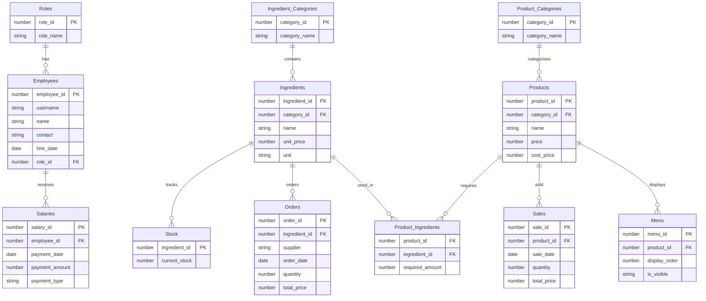

# 매장 관리 프로그램 프로젝트 개발 문서

## 1. 개요

### 1.1 프로젝트 설명

**프로젝트 이름**: 매장 관리 프로그램

**목적**: 소규모 사업장에서 상품 및 재고를 효율적으로 관리하기 위해 제작

**주요 기능**:
- 로그인/회원가입
- 관리자 메뉴 (관리자 전용)
- 재료 및 상품 등록
- 직원 정보 관리 및 급여 지급
- 재고 관리 및 재료 주문
- 판매 기능 (포스기 스타일)
- 다양한 보고서 생성

**개발 환경 및 사용 기술**:
- Java Development Kit (JDK) 17
- Oracle Database

### 1.2 시스템 아키텍처

```plaintext
+---------------------------+
|       UI Layer            |
|---------------------------|
| LoginUI, InventoryUI,     |
| SalesUI, ManagerUI,       |
| ProductManagementUI       |
+---------------------------+
             ↓
+---------------------------+
|     Service Layer         |
|---------------------------|
| CategoryDAO, EmployeeDAO, |
| IngredientDAO, MenuDAO,   |
| ReportDAO                 |
+---------------------------+
             ↓
+---------------------------+
|      Model Layer          |
|---------------------------|
| Category, Employee,       |
| Ingredient, Order,        |
| Product, Stock            |
+---------------------------+
             ↓
+---------------------------+
|    Database Layer         |
|---------------------------|
| DatabaseService,          |
| DBConnection              |
+---------------------------+
```

### 1.3 데이터베이스 설계

#### ERD 다이어그램



#### 엔터티 관계 설명

1. **Roles - Employees**
   - 각 직원은 특정 역할(Role)에 속함
   - 하나의 역할은 여러 직원을 가질 수 있음

2. **Employees - Salaries**
   - 각 직원은 여러 번의 급여를 받을 수 있음
   - 급여 정보는 직원과 연결됨

3. **Ingredient_Categories - Ingredients**
   - 재료는 특정 카테고리에 속함
   - 하나의 카테고리는 여러 재료를 포함할 수 있음

4. **Ingredients - Stock**
   - 각 재료의 현재 재고 추적
   - 1:1 관계

5. **Ingredients - Orders**
   - 재료 주문 관리
   - 하나의 재료는 여러 번 주문될 수 있음

6. **Products - Product_Ingredients**
   - 상품은 여러 재료를 필요로 함
   - 상품과 재료 간 다대다 관계

7. **Product_Categories - Products**
   - 각 상품은 특정 카테고리에 속함
   - 하나의 카테고리는 여러 상품을 포함할 수 있음

8. **Products - Sales**
   - 상품 판매 기록 관리
   - 하나의 상품은 여러 번 판매될 수 있음

9. **Products - Menu**
   - 메뉴에 표시될 상품 관리
   - 상품의 메뉴 노출 여부 및 순서 결정

## 2. 작업 진행

### 2.1 변경 사항
## 2.1 변경 사항

### 초기 기획 대비 제거된 기능

#### **출퇴근 기록**

- **초기 계획**: 출퇴근 기록은 직원의 근무 시간과 출퇴근 상태를 관리하는 기능으로, 직원들의 출근/퇴근 시간을 자동으로 기록하고 관리할 예정이었습니다.
- **변경 이유**: 이 기능은 초기 프로젝트 목표인 판매 시스템 중심의 관리와 맞지 않았고, 프로젝트 규모가 작고 간단히 운영되기를 원하므로 추가적인 복잡성을 줄이기 위해 제거되었습니다.

#### **직원 정보 조회**

- **초기 계획**: 직원들의 상세 정보를 조회할 수 있는 화면을 만들고, 이를 통해 직원들의 근무 정보, 급여 내역, 직급 등을 확인할 수 있는 기능을 제공할 계획이었습니다.
- **변경 이유**: 프로젝트의 핵심 기능인 판매 시스템과 관련이 없으며, 우선순위가 낮다고 판단되었습니다. 또한, 이미 로그인 시 직급에 따른 제한을 두었기 때문에, 이를 위한 별도의 조회 기능은 필요하지 않다고 판단하여 제거되었습니다.

#### **휴가 승인 및 근태 관리**

- **초기 계획**: 직원들의 휴가 신청과 승인, 근태 관리 기능을 구현하여 직원들의 출근/결근 및 휴가를 관리할 예정이었습니다.
- **변경 이유**: 이는 기본적인 판매 시스템 관리와 관계없는 기능이며, 업무량을 줄이기 위해 제외되었습니다. 후속 프로젝트로 확장할 여지가 있는 기능으로, 이번 프로젝트에서는 제외하기로 했습니다.

#### **이벤트 및 할인 적용**

- **초기 계획**: 특정 상품에 대한 이벤트 및 할인을 적용하는 시스템을 통해 판매 촉진을 도모할 계획이었습니다.
- **변경 이유**: 이 기능은 복잡한 로직과 관리가 필요하고, 판매 기능이 먼저 안정적으로 작동하는 것이 중요하다고 판단되었습니다. 이벤트나 할인 적용은 후속 프로젝트에서 고려할 예정입니다.

#### **재고 알람 시스템**

- **초기 계획**: 재고가 일정 수준 이하로 떨어졌을 때 알림을 보내는 시스템을 도입하여, 재고 관리를 효율적으로 하려는 계획이었습니다.
- **변경 이유**: 이 기능은 복잡성을 증가시키고, 초기 시스템에서 우선적으로 구현할 기능과는 거리가 멀다고 판단되었습니다. 후속 개발 단계에서 필요할 경우 추가하는 것으로 계획을 변경했습니다.

#### **로그인 실패 처리 및 계정 잠금**

- **초기 계획**: 보안을 강화하기 위해 로그인 실패 시 계정 잠금을 포함한 로그인 보호 기능을 구현할 계획이었습니다.
- **변경 이유**: 보안 기능은 중요하지만, 현재 프로젝트 규모에서 비즈니스 요구사항에 우선순위가 낮다고 판단되었습니다. 추가적인 보안 기능은 추후 구현을 고려하여 우선순위에서 제외되었습니다.

------

### 2.2 작업 방식의 문제점 및 개선 방향

#### **초기 자동화 설계의 복잡성 감소**

- **초기 설계**: 초기 기획에서 자동화된 시스템을 구축하려고 했으며, 자동으로 시스템을 업데이트하고 관리하는 시스템을 설계했습니다. 예를 들어, 데이터 입력 및 관리 자동화, 실시간 보고서 자동화 등의 기능을 계획했습니다.
- **문제점**: 시스템의 자동화가 과도하게 복잡해졌으며, 초기 프로젝트에서는 이러한 자동화 시스템이 실제로 필요한 기능이 아니었습니다. 실제 업무에서는 사용자 입력에 대한 관리와 단순화된 작업이 필요했기 때문에 자동화가 시스템 복잡도를 증가시킨다는 결론에 도달했습니다.
- **개선 방향**: 자동화는 향후 기능 확장에 필요한 부분으로 남겨두고, 초기에는 단순한 CRUD와 데이터 관리 기능에 집중하여 구현했습니다.

#### **코드 구조 단순화**

- **초기 설계**: 처음에는 많은 기능을 통합적으로 관리하려 했고, 여러 모듈을 나누어 복잡한 설계를 고려했습니다. 여러 기능을 동시에 처리하는 방식으로 시스템을 확장하려 했습니다.
- **문제점**: 코드가 지나치게 복잡해지고, 각 기능 간의 의존성이 높아져 유지보수나 기능 추가가 어려워졌습니다.
- **개선 방향**: 코드의 복잡도를 줄이기 위해 `Service` 클래스를 통합하고, DAO 및 UI 계층을 분리하여 각 기능을 독립적으로 관리할 수 있도록 했습니다. 후속 작업에서 기능을 하나씩 구현하는 방식을 채택하여 코드의 가독성을 높였습니다.

#### **팀원 학습 곡선을 고려한 기술 선택**

- **초기 설계**: 팀원들의 기술 수준을 고려하지 않고 초기 설계에 있어 다소 고급 기술을 사용하거나, 새로운 라이브러리나 프레임워크를 도입하려 했습니다.
- **문제점**: 새로운 기술 도입이 팀원들에게 추가적인 학습 부담을 주었고, 프로젝트 진행 속도가 더디게 되었습니다.
- **개선 방향**: 팀원들의 학습 곡선을 고려하여, 이미 익숙한 Java Swing을 사용하여 UI를 구현하고, 과도한 라이브러리나 기술을 사용하지 않도록 했습니다. 또한, 기존의 기술을 최적화하여 빠르게 결과를 얻을 수 있도록 방향을 조정했습니다.

#### **유지보수성 향상을 위한 아키텍처 개선**

- **초기 설계**: 아키텍처는 확장성 중심으로 설계했으나, 지나치게 복잡한 계층 구조와 의존성이 생겨서 유지보수가 어려워졌습니다.
- **문제점**: 초기 설계의 복잡성으로 인해, 후속 변경 사항이나 새로운 기능을 추가하는 데 어려움이 있었습니다.
- **개선 방향**: 아키텍처를 단순화하고, 유연한 구조로 수정하여 코드의 재사용성과 유지보수성을 높였습니다. 기능별로 독립적인 모듈을 구성하고, 각 모듈 간의 의존성을 최소화하여 향후 수정이 용이하도록 했습니다.

## 3. 프로젝트 진행 중 발생한 문제 및 해결

### 3.1 주요 문제점 및 해결 과정

#### UI/UX 문제
- **문제**: 판매 화면의 상품 추가 및 수량 입력 방식 어려움
- **해결**: 
  - 상품 클릭 시 입력 필드 초기화 로직 추가
  - 스크롤 가능한 상품 버튼 레이아웃 구현

#### 데이터베이스 설계 문제
- **문제**: 복잡한 데이터베이스 자동 설정 및 손익 계산서 처리
- **해결**:
  - 수동 SQL 스크립트로 전환
  - 손익 계산서 테이블 단순화
  - 시퀀스 및 트리거 최적화

#### 보고서 및 데이터 조회 문제
- **문제**: 다중 테이블 간 데이터 조회의 비효율성
- **해결**:
  - SQL 쿼리 최적화
  - 월별 손익 계산서 조회 UI 추가

#### 협업 및 코드 구조 문제
- **문제**: 복잡한 코드 구조와 유지보수성 저하
- **해결**:
  - `Service` 클래스 통합
  - DAO와 UI 계층 분리
  - 새로운 라이브러리 도입 최소화

### 3.2 향후 개선 방안

- 코드 구조의 지속적인 리팩토링
- 팀원 간 기술 공유 및 학습 프로세스 개선
- 확장성을 고려한 아키텍처 설계


1. 프로젝트 구조 설정 및 주요 기능 정의
프로젝트 목표: 판매 시스템을 중심으로 재료, 상품, 판매, 보고서 등 4개의 주요 메뉴를 구현하고, 이후 세부적인 CRUD 기능을 추가하는 것.
기본 화면 설계: 로그인 → 로비 → 메뉴 (재료 관리, 상품 관리, 판매 관리, 보고서 관리)
UI/UX 설계: 화면 간 전환을 최소화하고 직관적인 인터페이스 제공, 메뉴 간 이동 직관적으로 할 수 있도록 설계
기본 구현 순서: 로그인 화면, 로비 화면, 메뉴 화면(각 메뉴의 CRUD), 보고서 화면 구현.
2. 데이터베이스 설계 및 구축
테이블 및 관계 설정: Rank, Employees, Ingredients, Products, Sales, Orders, SalaryReport, SalaryPaymentDetails 등 주요 테이블을 설계 및 생성.
시퀀스 및 트리거 설정: 데이터 삽입에 필요한 시퀀스(seq_rank_id, seq_employee_id 등) 생성. TRG_UPDATE_STOCK_AFTER_SALE 트리거를 통해 판매 시 재고를 자동으로 업데이트하는 기능 구현.
기본 데이터 삽입 순서 문제: SALARYPAYMENTDETAILS 테이블 삽입 시 REPORT_ID가 없어서 외래 키 제약으로 오류 발생. 이를 해결하기 위해 먼저 SALARYREPORT 테이블에 데이터를 삽입한 후 SALARYPAYMENTDETAILS 테이블에 데이터를 삽입.
해결: SALARYREPORT 데이터를 먼저 삽입하고, SALARYPAYMENTDETAILS에서 REPORT_ID를 참조할 수 있도록 수정.
3. 문제 해결 및 디버깅
ORA-02291: foreign key violation: 외래 키 제약으로 인한 오류 발생. SALARYPAYMENTDETAILS 테이블에 데이터를 삽입할 때, SALARYREPORT 테이블에 REPORT_ID가 없어서 발생.

해결: SALARYREPORT 테이블에 먼저 데이터를 삽입하여 REPORT_ID를 참조할 수 있게 함.
ORA-00933: SQL command not properly ended: INSERT 구문에서 여러 값을 삽입하려고 할 때, 문법 오류가 발생.

해결: INSERT 구문에서 한 번에 여러 값을 삽입하려면 VALUES 구문에 한 번에 넣지 말고 개별적으로 삽입하도록 수정.
4. UI/UX 및 기능 구현
로그인 및 회원가입 화면: 로그인 후 로비 화면으로 이동하고, 로비에서 메뉴를 선택할 수 있도록 구현.
메뉴 화면: 판매, 재료 등록, 상품 등록, 보고서 등의 메뉴를 구성하고, 각 메뉴에서 관련된 CRUD 기능을 추가.
보고서 기능: 그래프와 차트를 활용하여 보고서를 시각적으로 제공.
메뉴 바 및 화면 간 전환: 로비에서 메뉴 간 이동이 직관적으로 이루어지도록 설계. 로비로 돌아가는 버튼을 배치하여 편리하게 화면을 전환할 수 있도록 함.
5. 데이터베이스와의 연동 및 동작 확인
DB와 UI 연동: Java Swing을 사용하여 UI 화면을 만들고, DB와 연결하여 CRUD 동작을 테스트.
최종 결과: 판매 시스템이 정상적으로 작동하고, 데이터베이스에서 데이터를 정확하게 삽입, 수정, 삭제하는지 확인.
6. 추후 계획
UI 최적화: 현재는 기본적인 UI/UX를 구현했으며, 향후 추가적으로 디자인을 개선하고, 애니메이션 및 사용자 경험을 향상시킬 예정.
확장성: 프로그램이 커지면서 쿼리 및 트리거 최적화, 성능 개선 등을 고려할 필요가 있음. 추후 더 큰 프로젝트를 진행할 때 쿼리 최적화, 데이터베이스 인덱스, 트리거 등의 성능 향상을 위한 최적화 작업이 필요할 것.
결론
문제 해결: 테이블과 데이터베이스 관계에 대한 문제, 외래 키 제약으로 인한 오류 등을 해결하고, 데이터 삽입 순서를 조정하여 시스템이 정상적으로 작동하도록 했습니다.
UI/UX 설계: 로그인 및 로비 화면, 메뉴 기능을 직관적으로 구현하고, 보고서 화면은 시각적으로 이해하기 쉽게 차트 및 그래프를 사용했습니다.
향후 개선점: UI/UX 최적화, 쿼리 및 트리거 최적화 작업을 통해 시스템을 더욱 효율적으로 만들 계획입니다.

- 재료 상품 직원 삭제 시 이전에 데이터가 다른곳에서 기록되고 그것이 연관되어있다면 삭제가 안되는 문제가 발생하여
이를 데이터에서 삭제하지 않고, 비활성화/ 활성화 처리를 하도록 바꿈
- EventManager - >  갱신 또는 조회 버튼으로 바꿈  혼선이 생겨서 바꿈 (복구탭에서 보고서 탭으로 이동하면 이때 다른 값들이 테이블에 노출되는 현상 때문에)
 

## 4. 협업

### 4.1 협업 방식

- 스터디 느낌으로 간단한 기능 구현하고 공유하는 식
- 개별 진행 느낌

### 4.2 협업의 어려움

- 초기 기술 이해도 차이
- 코드 스타일 및 접근 방식의 불일치 (MVC 패턴에 대한 이해 부족)
- 명확한 업무 분담을 하지 못하고, 계획적인 작업 스케줄을 세우지 않고 진행함.
- 초기 DB 설정의 부실함

### 4.3 향후 협업 개선 방향

- 초기 설정을 확실하게 진행하고, 테스트도 충분히 진행 한 뒤 작업에 들어가야함
- sql 테스트 (시퀀스 테이블 트리거 맞는지 ) 
- UI적인 측면에서 접근, 
- 효과적인 의사소통 채널 유지

---
