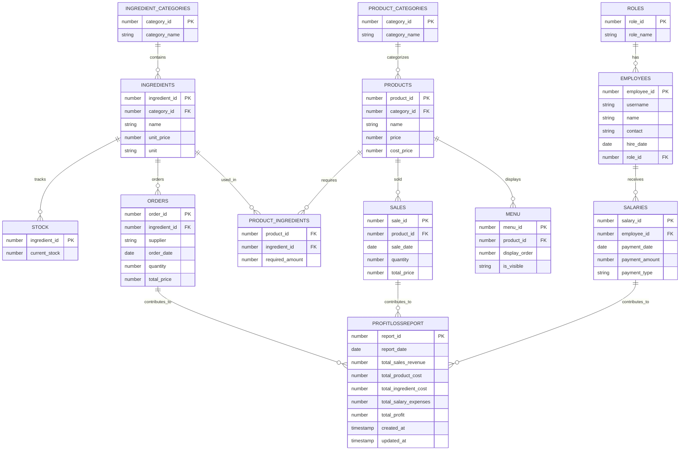

# 매장 관리 프로그램

## 1. 개요

### 1.1 프로젝트 설명

**프로젝트 이름**: 매장 관리 프로그램

**목적**: 소규모 사업장에서 상품 및 재고를 효율적으로 관리하고, 판매, 주문, 직원 관리 등을 지원하는 프로그램을 제작하기 위함. 

**주요 기능**:

- **로그인/회원가입**: 회원가입 기능을 통해 매장 관리 시스템에 접근할 수 있음. 각 사용자 유형에 따라 권한이 다르게 설정됨.

- **재고 관리 및 재료 주문**: 재고 상태를 실시간으로 확인하고, 재료 주문 시스템.

- **판매 기능 (포스기 스타일)**: 포스기 스타일의 UI를 통해 상품을 쉽게 추가하고 결제할 수 있는 기능을 구현함. 판매 내역은 실시간으로 반영됨.

- **관리자 메뉴 (관리자 전용)**

  : 관리자 전용 메뉴에서 재료 및 상품 등록, 직원 정보 관리 및 급여 지급, 다양한 보고서 생성이 가능.

  - **재료 및 상품 등록**: 재료와 상품 정보를 관리하고, 필요한 정보를 추가, 수정 및 삭제할 수 있는 기능을 제공.
  - **직원 정보 관리 및 급여 지급**: 직원의 정보를 관리하고, 급여 지급 내역을 기록하여 급여 지급을 관리.
  - **다양한 보고서 생성**: 매출 보고서, 주문 내역 보고서 급여 지급 보고서를 생성하고, 이를 기반으로 손익 계산서를 생성하여 매장 운영 현황을 확인할 수 있도록 함.

**개발 환경 및 사용 기술**:

- **Java Development Kit (JDK) 17**
- **Oracle Database**

------

### 1.2 시스템 아키텍처

이 시스템은 **계층화된 아키텍처**를 채택하여 유지보수성 및 확장성을 고려한 설계를 진행하였고, 아키텍처는 크게 **UI Layer**, **Service Layer**, **Model Layer**, **Database Layer**로 나누어져 있음.

```plaintext
+---------------------------+
|       UI Layer            |
|---------------------------|
| LoginUI, InventoryUI,     |
| SalesUI, ManagerUI,       |
| ProductManagementUI...    |
+---------------------------+
             ↓
+---------------------------+
|     Service Layer         |
|---------------------------|
| CategoryDAO, EmployeeDAO, |
| IngredientDAO, MenuDAO,   |
| ReportDAO...              |
+---------------------------+
             ↓
+---------------------------+
|      Model Layer          |
|---------------------------|
| Category, Employee,       |
| Ingredient, Order,        |
| Product, Stock...         |
+---------------------------+
             ↓
+---------------------------+
|    Database Layer         |
|---------------------------|
| DatabaseService,          |
| DBConnection              |
+---------------------------+
```

- **UI Layer**: 사용자와의 인터페이스를 담당하며, `LoginUI`, `InventoryUI`, `SalesUI`, `ManagerUI`, `ProductManagementUI` 등으로 구성되어 있음.
- **Service Layer**: 데이터베이스와의 상호작용을 담당하는 서비스 계층으로, `CategoryDAO`, `EmployeeDAO`, `IngredientDAO`, `MenuDAO`, `ReportDAO` 등으로 구성되어 있음.
- **Model Layer**: 시스템의 주요 데이터를 정의하는 계층으로, `Category`, `Employee`, `Ingredient`, `Order`, `Product`, `Stock` 등으로 구성되어 있음.
- **Database Layer**: 데이터베이스와의 연결을 담당하는 계층으로, `DatabaseService`와 `DBConnection`이 포함되어 데이터베이스 작업을 처리함.

------

### 1.3 데이터베이스 설계

데이터베이스는 매장 관리 시스템의 핵심 데이터를 저장하고 관리하는 역할을 함. 주요 테이블 및 관계를 설명하는 ERD는 아래와 같다. 시스템의 효율적인 운영을 위해 최소한의 데이터 관계를 설정하고, 각 테이블 간의 관계를 최적화하여 쿼리 성능을 높임.


전체적인 테이블 구조는  직원, 재료, 상품으로 구분하며 각각의 데이터들은 손익계산서 테이블로 향하게 설계를 하였다. 

## 2. 작업 진행

### **2.1 초기 기획 단계 주요 기능 및 상세 설명**

- **로그인 및 출근/퇴근 관리**:
  - **초기 계획**: 직원 ID와 비밀번호를 이용한 로그인 기능을 구현하며, 각 직원의 출근과 퇴근 시간을 자동으로 기록하고 관리하는 기능.
  - 기능 상세
    - **출퇴근 시간 기록**: 직원이 출근과 퇴근 시 시스템에서 자동으로 기록.
    - **출근자 확인**: 현재 출근 중인 직원 목록을 확인할 수 있는 기능.
    - **권한별 접근 제어**: 관리자는 전체 직원 정보를 확인할 수 있으며, 일반 직원은 자신의 정보만 조회할 수 있도록 제한.

- **직원 관리**:
  - **초기 계획**: 직원들의 정보를 관리하는 기능으로, 신규 직원 등록, 정보 수정, 퇴직자 처리 등을 포함한 시스템을 구축하려 했고, 직원들의 세부적인 정보와 근로 상황을 확인할 수 있는 기능.
  - 기능 상세
    - **등록**: 신규 직원 추가 기능 (사진, 이름, 직책, 연락처 등).
    - **수정**: 기존 직원 정보 수정 기능.
    - **삭제**: 퇴직자 처리 기능.
    - **급여 관리**: 급여 및 보너스 정산 기능.
    - **권한 관리**: 직원은 권한에 따라 조회할 수 있는 정보가 제한됨.

- **메뉴 상품 관리**:
  - **초기 계획**: 메뉴 상품을 관리하는 시스템으로, 재고 상태를 확인하고, 판매 설정과 이벤트, 할인 등을 처리하는 기능과 메뉴별 재고 관리, 판매 가격 설정, 메뉴 활성화/비활성화 등의 작업을 할 수 있는 기능.
  - 기능 상세
    - **재고 확인 및 수정**: 각 메뉴 항목에 대한 재고 확인 및 수정.
    - **판매 설정**: 메뉴의 가격 설정과 할인율 적용.
    - **판매 관리**: 메뉴 항목을 활성화 또는 비활성화하여 판매 상태를 관리.

- **재고 관리**:
  - **초기 계획**: 재료의 재고를 관리하고, 부족할 경우 자동으로 알림을 보내는 시스템을 구축하려 했고, 발주 및 주문 기록을 관리하여 재고를 지속적으로 보충하는 시스템.
  - 기능 상세
    - **재료 재고 관리**: 재료별 재고 상태 확인 및 수정.
    - **주문 기록 관리**: 발주 및 주문 기록 저장과 추적.

- **스케줄 관리**:
  - **초기 계획**: 직원의 휴가 및 일정을 관리하며, 가게의 이벤트 및 주문 스케줄을 조율하는 시스템을 계획했고, 이를 통해 직원들의 일정 충돌을 방지하고, 가게 운영을 원활하게 할 수 있는 시스템.
  - 기능 상세
    - **직원 스케줄 관리**: 휴가 및 근무 일정을 관리하고, 일정 충돌 시 알림 제공.
    - **가게 이벤트 관리**: 가게에서 진행되는 이벤트와 주문 일정 및 재고를 연동하여 관리.

- **인사 관리**:
  - **초기 계획**: 직원들의 휴가, 병가, 조퇴 등을 신청하고 승인하는 시스템을 포함하려 했고, 또한 직원들의 근로 시간과 관련된 인사 업무를 처리하는 기능.
  - 기능 상세
    - **휴가, 병가, 조퇴 신청 관리**: 직원이 휴가나 병가를 신청하면 관리자 승인 후 반영.
    - **승인/반려 시스템**: 직원의 인사 요청에 대해 관리자 승인 및 반려 처리.

- **보고서 생성 및 알림**:
  - **초기 계획**: 월별 매출, 재고 소모, 직원 근무 기록 등 주요 데이터를 요약하여 보고서를 생성하는 기능을 계획했습니다. 또한 재고 부족 및 미처리 요청에 대한 알림 시스템.
  - 기능 상세
    - **월별 보고서 생성**: 월별 매출, 재고 소모, 직원 근무 기록 등을 보고서로 생성.
    - **알림 시스템**: 재고 부족, 미처리 요청에 대한 알림.

------

### **2.2 변경 사항**

#### **초기 기획 대비 제거된 기능**

- **출퇴근 기록**
  - **초기 계획**: 직원들의 출퇴근 시간을 자동으로 기록하고 관리하는 시스템을 구현할 계획이었습니다.
  - **변경 이유**: 재고 관리 및 판매 시스템을 효율적으로 집중적으로 관리하는 것이 더 중요한 목표로 변경되었으며, 출퇴근 기록 기능은 이 시점에서는 우선순위가 낮다고 판단되어 제외되었습니다. 추후 프로젝트에서 확장 가능성이 있음.

- 직원 정보 조회

  :

  - **초기 계획**: 직원들의 상세 정보를 조회할 수 있는 화면을 통해 근무 정보, 급여 내역, 직급 등을 확인할 수 있도록 할 계획이었습니다.
  - **변경 이유**: 핵심 기능인 판매와 재고 관리 시스템에 집중하기 위해, 직원 정보 조회 기능을 제외하고 급여 지급 내역 보고서로 변경하였습니다. 이는 매장 내 급여 지출 관리에 더 적합한 방식으로 판단되었으며, 향후 직원 관리 기능으로 확장 가능성 있음.

- 휴가 승인 및 근태 관리

  :

  - **초기 계획**: 직원들의 휴가 신청과 승인, 근태 관리 기능을 구현하려 했습니다.
  - **변경 이유**: 시스템 복잡성을 줄이기 위해 이 기능은 제외되었습니다. 향후 직원 관리 기능을 추가할 수 있는 확장 가능성이 있습니다.

- 이벤트 및 할인 적용

  :

  - **초기 계획**: 특정 상품에 대한 할인 및 이벤트 적용 기능을 구현할 계획이었습니다.
  - **변경 이유**: 판매 시스템이 안정적으로 작동하는 것이 우선이었고, 복잡한 할인 로직과 이벤트 시스템이 과도한 작업량을 초래할 수 있기에 이 기능은 제외되었습니다. 향후 확장 프로젝트에서 고려될 수 있습니다.

- 재고 알람 시스템

  :

  - **초기 계획**: 재고가 일정 수준 이하로 떨어졌을 때 자동으로 알림을 보내는 시스템을 구축할 계획이었습니다.
  - **변경 이유**: 이 기능은 재고 부족 시 결제가 불가능하도록 변경되었습니다. 알림 기능은 추후 UI/UX 개선과 함께 추가할 수 있도록 남겨두었습니다.

- 로그인 실패 처리 및 계정 잠금

  :

  - **초기 계획**: 보안을 강화하기 위해 로그인 실패 시 계정을 잠그고, 로그인 보호 기능을 구현할 계획이었습니다.
  - **변경 이유**: 보안은 중요하지만, 이번 프로젝트에서는 규모가 작은 만큼 간단한 로그인 기능으로 대체하였습니다. 추후 보안 기능이 필요하면 추가할 수 있도록 설계되었습니다.
------

### 2.3 작업 방식의 문제점 및 개선 방향

- **초기 자동화 설계의 복잡성 감소**:
  - **초기 설계**: 시스템의 자동화 비율을 높여 데이터 입력 및 관리 자동화, 실시간 보고서 자동화 등을 구축하려 했습니다.
  - **문제점**: 자동화가 과도하게 복잡해졌고, 실제로 필요한 기능이 아니었으며, 관리 시스템에 더 중점을 두는 것이 좋다고 판단되었습니다.
  - **개선 방향**: 초기에는 자동화보다는 기본적인 CRUD와 데이터 관리 기능을 구현하여 시스템의 복잡도를 낮추고, 향후 자동화 기능을 추가하는 방향으로 진행할 수 있도록 했습니다.
- **코드 구조 단순화**:
  - **초기 설계**: 복잡한 설계를 통해 여러 기능을 동시에 처리하려 했고, 많은 모듈을 하나로 통합하는 구조였습니다.
  - **문제점**: 지나치게 복잡한 코드 구조는 유지보수와 기능 추가가 어렵게 했습니다.
  - **개선 방향**: DAO와 UI 계층을 분리하여 각각의 기능을 독립적으로 관리할 수 있도록 했습니다. 이를 통해 각 모듈의 책임을 명확히 하고, 향후 기능 확장을 용이하게 하였습니다.
- **학습 곡선과 진행 속도를 고려한 기술 선택**:
  - **초기 설계**: 새로운 라이브러리와 기술을 도입하여 기능 구현을 최적화하려 했습니다.
  - **문제점**: 새로운 기술을 도입하면서 발생한 학습 부담과 프로젝트 진행 속도 저하가 있었습니다.
  - **개선 방향**: Java Swing을 사용하여 UI를 구현하고, 불필요한 라이브러리나 복잡한 기술을 피하여 빠르게 프로토타입을 제작했습니다. 이를 통해 기술적 부담을 줄이고 프로젝트 진행 속도를 높였습니다.
- **유지보수성 향상을 위한 아키텍처 개선**:
  - **초기 설계**: 확장성을 고려한 복잡한 아키텍처 설계를 하였지만, 실제로는 관리가 어려운 구조가 되었습니다.
  - **문제점**: 초기 설계가 복잡해져서 새로운 기능을 추가하거나 수정하는 데 어려움이 있었습니다.
  - **개선 방향**: 아키텍처를 단순화하고 유연하게 수정할 수 있도록 DB, Model(DTO), Service(DAO), UI 계층으로 나누어 관리하기 용이한 구조로 개선하였습니다. 이를 통해 기능 추가가 용이하고, 유지보수성도 향상되었습니다.

------

## 3. 프로젝트 진행 중 발생한 문제 및 해결

### 3.1 주요 문제점 및 해결 과정

- **UI/UX 문제**
  - **문제**: 화면 갱신 및 데이터 변동에 따른 조회 기능이 일관되지 않음.
  - **해결**: 각 화면에 조회 및 갱신 버튼을 추가하여 데이터 갱신을 명확히 구현했습니다. 이로 인해 각 화면에서 필요한 데이터를 명시적으로 갱신할 수 있게 되었습니다.
- **데이터베이스 설계 문제**
  - **문제**: 손익 계산서 및 관련된 DB 설계가 미비했으며, 여러 테이블 간의 관계를 제대로 고려하지 않았습니다.
  - **해결**: 손익 계산서 테이블을 단순화하고, 최소한의 데이터로 확장 가능한 구조로 변경하여 관계를 간소화했습니다. 이를 통해 각 기능을 쉽게 확장할 수 있게 되었습니다.

------

## 4. 향후 개선 방안

- **코드 구조의 지속적인 리팩토링**:
  - 각 기능을 독립적으로 관리하는 방식으로 리팩토링을 진행할 예정입니다. 이를 통해 코드 품질을 지속적으로 개선하고, 향후 시스템 유지보수를 용이하게 할 수 있습니다.
- **매장 관리 관련 기능 확장**:
  - 향후 **키오스크**, **직원 근태 관리**, **주방 알림 시스템** 등 다양한 추가 기능을 고려하고 있습니다. 기존에 설계된 DB와 테이블 구조를 활용하여 다양한 기능을 확장할 수 있을 것입니다.

------

## 5. 협업

### 5.1 협업 방식

- **초기 단계**: 개별적으로 기능을 개발하고, 이후 CRUD 기능 및 DB 설계 검증을 통해 작업을 확장하였습니다.
- **기능 분담**: 각 팀원은 독립적으로 작업을 진행하였고, 팀 내에서 기능을 분담하여 개발을 진행했습니다. 하지만 기술적 이해도 차이로 일부 어려움이 있었으며, 이를 극복하기 위한 지속적인 커뮤니케이션이 필요했습니다.

### 5.2 향후 협업 개선 방향

- **초기 설정과 테스트를 철저히 진행한 후 작업에 들어가야 함**: 초기 기획과 DB 설계를 명확히 하고, 이를 기반으로 충분한 테스트를 진행하여 개발 중 발생할 수 있는 문제를 최소화해야 합니다.
- **협업 툴을 적극 활용하고, 명확한 업무 분담을 통해 효율적인 진행을 도모해야 함**: 팀원 간 협업 툴을 적극적으로 활용하고, 각자 맡은 업무를 명확히 분담하여 프로젝트 진행이 체계적으로 이루어지도록 해야 합니다.
- **정기적인 회의와 코드 리뷰**: 일정 주기로 팀 회의를 열어 진행 상황을 공유하고, 코드 품질을 높이기 위해 코드 리뷰를 진행하는 것이 중요합니다.
- **버전 관리 시스템 활용**: Git과 같은 버전 관리 시스템을 적극적으로 활용하여 코드 변경 사항을 효과적으로 관리하고, 작업 충돌을 방지해야 합니다.
- **공통된 개발 기준 설정**: 코드 스타일, 네이밍 규칙 등 공통 개발 기준을 설정하여 코드의 일관성을 유지하고, 유지보수 및 확장성을 높여야 합니다.
- **문서화 및 개발 환경 공유**: 개발 중 발생한 문제 해결 과정과 프로젝트 환경 설정에 대한 문서를 작성하여 팀원들이 원활하게 작업을 시작할 수 있도록 돕습니다.

------

## 결론

이번 프로젝트는 **매장 관리 시스템**을 구축하고 관리하는 것을 목표로 하여 진행되었습니다. **초기 설계**에서 발생한 **과도한 자동화** 및 **기능 복잡성** 문제를 해결하고, **핵심 기능에 집중**하여 **효율적인 시스템**을 구현할 수 있었습니다. 또한, **UI/UX**와 **DB 설계**에서 발생한 문제들을 해결하며, 향후 **기능 확장** 및 **유지보수성**을 고려한 설계를 했습니다.

**향후 프로젝트 진행**에 있어 **협업 툴**의 **적극적인 활용**과 **기능 확장**을 위한 **명확한 기준 설정**이 중요한 역할을 할 것입니다. 이번 프로젝트에서 얻은 경험을 바탕으로 **더 나은 시스템 설계**와 **협업 환경**을 구축해 나갈 수 있을 것입니다.
