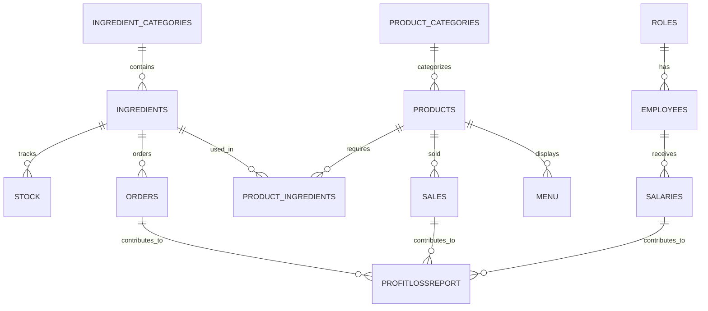
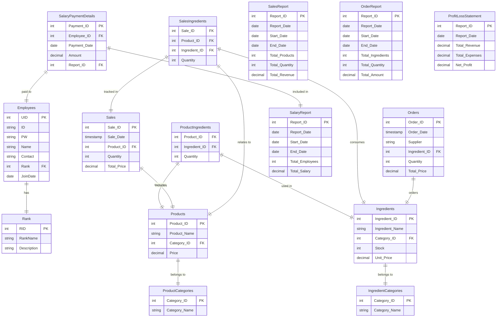
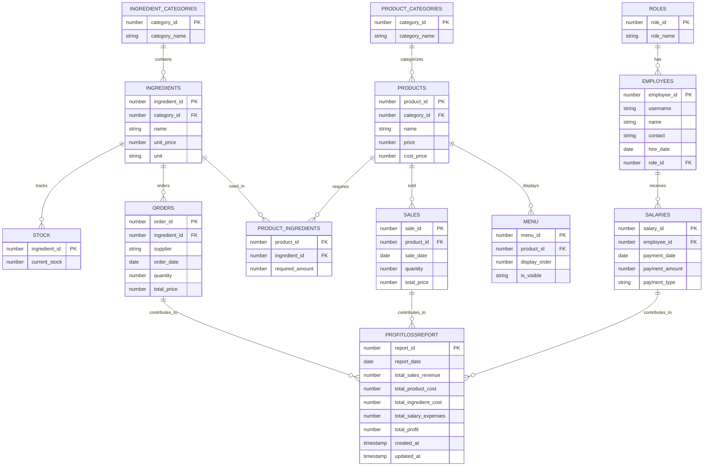

# 매장 관리 프로그램 프로젝트 종료 보고서

## 1. 개요

### 1.1 프로젝트 설명

**프로젝트 이름**: 매장 관리 프로그램

**목적**: 소규모 사업장에서 상품 및 재고를 효율적으로 관리하고, 판매, 주문, 직원 관리 등을 지원하는 프로그램을 제작하기 위함.

**주요 기능**:

- **로그인/직원등록**: 직원 등록 기능을 통해 매장 관리 시스템에 접근하며, 각 사용자 유형에 따라 권한이 다르게 설정됨.

- **재고 관리 및 재료 주문**: 실시간 재고 확인 및 자동 재료 주문 시스템.

- **판매 기능 (포스기 스타일)**: 포스기 스타일의 UI를 통해 상품을 쉽게 추가하고 결제할 수 있는 기능 구현. 판매 내역 실시간 반영.

- 관리자 메뉴 (관리자 전용)

  : 관리자 전용 메뉴에서 재료 및 상품 등록, 직원 정보 관리, 급여 지급 및 다양한 보고서 생성 가능.

  - **재료 및 상품 등록**: 재료와 상품 정보를 관리하고 필요한 정보를 추가, 수정, 삭제할 수 있는 기능.
  - **직원 정보 관리 및 급여 지급**: 직원의 정보를 관리하고 급여 지급 내역 기록 및 관리.
  - **다양한 보고서 생성**: 매출 보고서, 주문 내역 보고서, 급여 지급 보고서를 생성하고 손익 계산서를 통해 매장 운영 현황 확인.

**개발 환경 및 사용 기술**:

- **Java Development Kit (JDK) 17**
- **Oracle Database**

------

### 1.2 시스템 아키텍처

**계층화된 아키텍처**를 채택하여 유지보수성 및 확장성을 고려한 설계를 진행하였고, 아키텍처는 크게 **UI Layer**, **Service Layer**, **Model Layer**, **Database Layer**로 나누어져 있음.

```plaintext
+---------------------------+
|       UI Layer            |
|---------------------------|
| LoginUI, InventoryUI,     |
| SalesUI, ManagerUI,       |
| ProductManagementUI...    |
+---------------------------+
             ↓
+---------------------------+
|     Service Layer         |
|---------------------------|
| CategoryDAO, EmployeeDAO, |
| IngredientDAO, MenuDAO,   |
| ReportDAO...              |
+---------------------------+
             ↓
+---------------------------+
|      Model Layer          |
|---------------------------|
| Category, Employee,       |
| Ingredient, Order,        |
| Product, Stock...         |
+---------------------------+
             ↓
+---------------------------+
|    Database Layer         |
|---------------------------|
| DatabaseService,          |
| DBConnection              |
+---------------------------+
```

- **UI Layer**: 사용자와의 인터페이스 담당 (`LoginUI`, `InventoryUI`, `SalesUI`, `ManagerUI`, `ProductManagementUI` 등)
- **Service Layer**: 데이터베이스와의 상호작용 담당 (`CategoryDAO`, `EmployeeDAO`, `IngredientDAO`, `MenuDAO`, `ReportDAO` 등)
- **Model Layer**: 주요 데이터 정의 (`Category`, `Employee`, `Ingredient`, `Order`, `Product`, `Stock` 등)
- **Database Layer**: 데이터베이스와의 연결 담당 (`DatabaseService`, `DBConnection`)

------

### 1.3 데이터베이스 설계

매장 관리 시스템의 핵심 데이터를 저장하고 관리하는 데이터베이스 설계:

- 주요 테이블 및 관계를 최적화하여 쿼리 성능 향상.
- **손익 계산서** 테이블을 포함한 모든 테이블 간 관계를 명확히 정의하여 확장성을 고려한 설계.



------

## 2. 작업 진행

### **2.1 초기 기획 단계 주요 기능 및 상세 설명**

#### **로그인 및 출근/퇴근 관리**

- **초기 계획**: 직원 ID와 비밀번호를 이용한 로그인 기능을 구현하고, 각 직원의 출근과 퇴근 시간을 자동으로 기록하고 관리하는 기능을 도입할 예정이었음.
- 기능 상세
  - **출퇴근 시간 기록**: 직원이 출퇴근할 때, 시스템에서 자동으로 해당 시간을 기록하는 방식으로 출퇴근 데이터를 관리.
  - **출근자 확인**: 시스템을 통해 현재 출근 중인 직원들의 목록을 실시간으로 확인할 수 있는 기능을 제공.
  - **권한별 접근 제어**: 관리자는 전체 직원 정보를 확인할 수 있고, 일반 직원은 자신의 정보만 조회할 수 있도록 제한하는 방식으로 보안성을 높임.

#### **직원 관리**

- **초기 계획**: 직원들의 정보를 관리하는 기능으로, 신규 직원 등록, 정보 수정, 퇴직자 처리 등 직원들의 세부적인 정보와 근로 상황을 확인하고 관리할 수 있는 기능을 구축할 예정이었음.
- 기능 상세
  - **등록**: 신규 직원을 등록할 수 있는 기능으로, 직원의 사진, 이름, 직책, 연락처 등의 정보를 입력하여 직원 정보를 시스템에 추가.
  - **수정**: 기존 직원의 정보를 수정할 수 있는 기능. 직원의 연락처, 직책 등 변경된 정보를 반영.
  - **삭제**: 퇴직자의 정보를 삭제하거나 비활성화하여 더 이상 조회할 수 없도록 처리.
  - **급여 관리**: 직원의 급여와 보너스 정산 기능을 제공하여, 월별 급여 지급 내역을 관리.
  - **권한 관리**: 직원이 접근할 수 있는 정보와 시스템의 범위를 역할에 따라 제한하는 권한 관리 기능.

#### **메뉴 상품 관리**

- **초기 계획**: 메뉴 상품을 관리하는 시스템을 통해, 재고 상태를 확인하고, 판매 설정 및 이벤트/할인 기능을 관리하는 기능을 도입할 예정이었음.
- 기능 상세
  - **재고 확인 및 수정**: 각 메뉴 항목에 대한 재고를 실시간으로 확인하고, 필요한 경우 재고 수치를 수정할 수 있는 기능.
  - **판매 설정**: 메뉴 항목의 가격 설정 및 할인율 적용, 메뉴 항목의 판매 활성화/비활성화 설정.
  - **판매 관리**: 메뉴 항목의 판매 상태를 활성화 또는 비활성화하여 판매 여부를 조정하는 기능.

#### **재고 관리**

- **초기 계획**: 재료의 재고를 관리하고, 재고 부족 시 자동으로 알림을 보내는 시스템과 발주 및 주문 기록을 관리하여 재고를 지속적으로 보충하는 기능을 제공할 예정이었음.
- 기능 상세
  - **재료 재고 관리**: 재료별 재고 상태를 확인하고, 필요에 따라 수정을 할 수 있는 기능을 제공.
  - **주문 기록 관리**: 발주 및 주문 기록을 저장하고, 재고 부족 시 해당 데이터를 기준으로 자동으로 발주가 이루어지도록 설정.

#### **스케줄 관리**

- **초기 계획**: 직원들의 휴가 및 일정을 관리하고, 가게의 이벤트와 주문 스케줄을 조율하는 시스템을 도입할 예정이었음.
- 기능 상세
  - **직원 스케줄 관리**: 직원들의 휴가와 근무 일정을 관리하고, 일정 충돌 시 알림을 제공하는 기능.
  - **가게 이벤트 관리**: 가게에서 진행되는 이벤트와 주문 일정, 재고 연동을 통해 가게 운영을 효율적으로 관리.

#### **인사 관리**

- **초기 계획**: 직원들의 휴가, 병가, 조퇴 등을 신청하고 승인하는 시스템을 포함하여, 직원들의 근로 시간과 관련된 인사 업무를 처리하는 기능을 제공할 예정이었음.
- 기능 상세
  - **휴가, 병가, 조퇴 신청 관리**: 직원이 휴가, 병가, 조퇴를 신청하면 관리자가 이를 승인하거나 반려하는 시스템을 제공.
  - **승인/반려 시스템**: 직원의 인사 요청에 대해 관리자 승인을 통해 처리하며, 반려 시 사유를 기록.

#### **보고서 생성 및 알림**

- **초기 계획**: 월별 매출, 재고 소모, 직원 근무 기록 등 주요 데이터를 요약하여 보고서를 생성하고, 미처리 요청에 대한 알림 기능을 도입할 예정이었음.
- 기능 상세
  - **월별 보고서 생성**: 매출, 재고 소모, 직원 근무 기록 등을 기반으로 월별 보고서를 생성하여, 관리자에게 필요한 정보를 제공.
  - **알림 시스템**: 재고 부족, 미처리 요청 등에 대해 실시간으로 알림을 제공하여 업무의 원활한 진행을 돕는 기능.
------

### **2.2 변경 사항**

#### **초기 기획 대비 제거된 기능**

- **출퇴근 기록**
  - **초기 계획**: 직원들의 출퇴근 시간을 자동으로 기록하고 관리하는 시스템을 구현할 계획이었음.
  - **변경 이유**: 재고 관리 및 판매 시스템에 효율적으로 집중하는 것이 더 중요한 목표로 설정되었으며, 출퇴근 기록 기능은 현재 우선순위에서 제외됨. 

- **직원 정보 조회**
  - **초기 계획**: 직원들의 상세 정보를 조회할 수 있는 기능을 통해 근무 정보, 급여 내역, 직급 등을 확인하는 기능을 포함할 예정이었음.
  - **변경 이유**: 판매 및 재고 관리 시스템이 우선시되어, 직원 정보 조회 기능을 제외하고 **급여 지급 내역 보고서**로 대체. 이는 매장 내 급여 지출 관리와 관련된 기능을 더욱 효율적으로 제공하기 위해 결정됨.

- **휴가 승인 및 근태 관리**
  - **초기 계획**: 직원들의 휴가 신청 및 승인, 근태 관리 기능을 구현할 계획이었음.
  - **변경 이유**: 시스템의 복잡성을 줄이고, 핵심적인 기능에 집중하기 위해 해당 기능은 제외됨. 

- **이벤트 및 할인 적용**
  - **초기 계획**: 특정 상품에 대한 할인 및 이벤트 적용 기능을 구현할 계획이었음.
  - **변경 이유**: 판매 시스템의 안정성 확보와 복잡한 이벤트 및 할인 로직을 구현하기 위한 시간과 자원의 제약으로 인해 해당 기능은 제외됨. 

- **재고 알람 시스템**
  - **초기 계획**: 재고가 일정 수준 이하로 떨어졌을 때 자동으로 알림을 보내는 시스템을 구축할 계획이었음.
  - **변경 이유**: 재고 부족 시 결제 불가능 기능으로 대체되어 알림 시스템은 추후 UI/UX 개선과 함께 추가할 예정.

- **로그인 실패 처리 및 계정 잠금**
  - **초기 계획**: 보안을 강화하기 위해 로그인 실패 시 계정을 잠그고 로그인 보호 기능을 구현할 계획이었음.
  - **변경 이유**: 프로젝트 규모가 작은 점을 고려하여 간단한 로그인 기능으로 대체함.
------

### **2.3 작업 방식의 문제점 및 개선 방향**

#### **초기 자동화 설계의 복잡성 감소**

- **초기 설계**: 시스템의 효율성을 극대화하기 위해 데이터 입력, 관리, 실시간 보고서 작성 등 가능한 한 많은 작업을 자동화하는 포괄적인 계획을 수립했고, 시스템의 모든 영역에 자동화를 적용하여 생산성을 높이고자 했음.
- **문제점**: 과도한 자동화 접근은 오히려 시스템을 불필요하게 복잡하게 만들었고, 실제로 필요로 하는 기본적인 관리 기능보다 자동화에 더 많은 리소스를 투입하게 되었고, 이로 인해 개발 부담이 증가했음. 자동화 기능의 과도한 구현은 시스템의 관리와 유지보수를 오히려 어렵게 만들게 되었음.
- **개선 방향**: 초기 설계 전략을 전환하여 자동화보다는 기본적인 CRUD(생성, 읽기, 수정, 삭제) 기능과 데이터 관리에 우선순위를 두고, 시스템의 핵심 기능을 먼저 안정적으로 구현한 후 필요에 따라 점진적으로 자동화 기능을 추가하는 방식으로 접근함.
- **결과**: 기본적인 CRUD 기능을 먼저 안정적으로 구현함으로써 시스템의 기반을 튼튼하게 구축 함. 이후 점진적인 자동화 기능 추가를 통해 시스템의 복잡도를 관리 가능한 수준으로 유지하면서, 유연하고 확장 가능한 시스템을 구축할 수 있었음.

#### **코드 구조 단순화**

- **초기 설계**: 초기에는 여러 기능을 동시에 구현하기 위해 복잡한 아키텍처를 설계했음. 모든 모듈을 통합하여 시스템 전체 기능을 한 번에 처리하려는 야심찬 계획을 세움.
- **문제점**: 복잡한 설계로 인해 개발 속도가 크게 저하되었고, 각 기능의 통합과 병합 과정에서 상당한 어려움을 겪었음. 다양한 기능을 동시에 개발하면서 버그와 기능 충돌이 빈번하게 발생했고, 이를 해결하는 데 많은 시간이 소요되었음.
- **개선 방향**: 개발 효율성을 높이기 위해 DAO와 UI 계층을 명확하게 분리함. 각 모듈의 책임을 명확히 하고, 우선순위가 높은 기능부터 순차적으로 개발하는 방식으로 전환함. 이를 통해 코드의 유지보수성을 크게 향상시키고, 향후 기능 확장의 기반을 마련함.
- **결과**: 기능 간 의존성을 최소화하고 각 계층을 독립적으로 관리함으로써 시스템의 복잡도를 낮춤. 이러한 접근은 향후 프로젝트의 확장성과 유지보수성을 크게 개선할 수 있는 토대가 되었음.

#### **학습 곡선과 진행 속도를 고려한 기술 선택**

- **초기 설계**: 프로젝트의 기능을 최적화하고 개발 효율성을 높이기 위해 최신 라이브러리와 기술 스택을 적용하려 했음.
- **문제점**: 새로운 기술 도입으로 인한 학습 부담이 예상보다 크게 나타났고, 이로 인해 프로젝트 진행 속도가 현저히 저하되었음. 실제로 필요하지 않은 기술을 도입함으로써 불필요한 학습 시간과 복잡성만 증가시켰음.
- **개선 방향**: Java Swing을 사용하여 UI를 구현하고, 불필요한 라이브러리와 복잡한 기술을 제외함. 먼저 프로토타입을 제작하고 이를 바탕으로 프로젝트를 진행함으로써 작업 속도를 높임. Java Swing의 상대적으로 낮은 학습 곡선을 활용하여 핵심 기능 구현에 집중함.
- **결과**: 익숙한 기술을 사용함으로써 개발 속도를 크게 향상시켰고, 기술적 어려움을 최소화할 수 있었음. 또한, 향후 필요에 따라 다른 기술을 도입할 수 있는 유연한 기반을 마련했음.

#### **유지보수성 향상을 위한 아키텍처 개선**

- **초기 설계**: 확장성을 고려하여 복잡한 아키텍처를 설계했지만, 실제로는 관리가 매우 어려운 구조가 되었음.
- **문제점**: 초기 설계의 복잡성으로 인해 새로운 기능 추가나 기존 기능 수정이 어려웠음. 기능 간 높은 의존성으로 인해 일부 기능을 수정할 경우 전체 시스템에 광범위한 영향을 미치는 문제가 발생했음.
- **개선 방향**: 아키텍처를 단순화하고 유연성을 높이기 위해 DB, Model(DTO), Service(DAO), UI 계층으로 명확하게 분리함. 각 계층의 책임을 명확히 하고 기능 간 의존성을 최소화하여, 향후 기능 추가와 수정이 용이한 구조로 개선함.
- **결과**: 아키텍처 단순화를 통해 시스템의 유지보수성과 확장성을 크게 향상시킴. 각 계층을 독립적으로 관리할 수 있게 됨으로써, 향후 프로젝트에서 기능 추가와 수정을 더욱 효율적으로 수행할 수 있게 되었음.
------

## 3. 프로젝트 진행 중 발생한 문제 및 해결

#### 3.1 주요 문제점 및 해결 과정

##### **UI/UX 문제**

- **문제**: 화면 갱신 및 데이터 변동 시 조회 기능이 일관되지 않음. 예를 들어, **EventManager**를 사용하여 이벤트를 처리했지만, 새로운 기능 추가 시 수정해야 하는 번거로움이 발생함.
- **해결**: 각 화면에 조회 및 갱신 버튼을 추가하여 데이터 갱신을 명확히 구현. 이로 인해 사용자가 데이터 변동 사항을 명시적으로 확인할 수 있게 됨.
- **구체적 해결 방안**:
  **EventManager**를 활용하여 각 화면에서 발생한 이벤트를 처리하고, 특정 데이터 변경 시 이벤트를 발생시켜 다른 화면에서 이를 반영하도록 함.
  그러나 **EventManager**로 관리하는 방식은 관리해야 할 기능이 많아져 코드가 복잡해질 수 있어, 현재 프로젝트에서 실질적으로 구현하기엔 시간이 부족하고, 추후 더 큰 프로젝트에서 이 방식을 사용하는 것이 더 효율적이라고 판단함.
- **추후 참고 사항**:
  새로운 프로젝트에서 **EventManager** 패턴을 더 적극적으로 활용하여, 각 화면의 갱신을 **한 곳에서 중앙 관리**할 수 있도록 설계할 계획. 이를 통해 화면 간 갱신 흐름을 명확히 하고, 시스템 확장성 또한 높일 수 있을 것으로 예상됨.

**EventManager 코드 예시**:

```java
package ui;

import java.util.ArrayList;
import java.util.HashMap;
import java.util.List;
import java.util.Map;

public class EventManager {
    private static final EventManager instance = new EventManager();
    private final Map<String, List<Runnable>> eventListeners = new HashMap<>();

    // Singleton Pattern
    private EventManager() {}

    public static EventManager getInstance() {
        return instance;
    }

    // 이벤트 리스너 추가
    public void subscribe(String eventType, Runnable listener) {
        eventListeners.computeIfAbsent(eventType, k -> new ArrayList<>()).add(listener);
    }

    // 특정 이벤트 발생
    public void notifyListeners(String eventType) {
        List<Runnable> listeners = eventListeners.get(eventType);
        if (listeners != null) {
            for (Runnable listener : listeners) {
                listener.run();
            }
        }
    }

    // 등록된 리스너 출력 (디버깅용)
    public void printListeners(String eventType) {
        List<Runnable> listeners = eventListeners.get(eventType);
        if (listeners != null) {
            System.out.println("Listeners for event: " + eventType);
            for (Runnable listener : listeners) {
                System.out.println(listener);
            }
        } else {
            System.out.println("No listeners for event: " + eventType);
        }
    }
}
```

**EventTypes 예시**:

```java
package ui;

public class EventTypes {
    public static final String INGREDIENT_UPDATED = "INGREDIENT_UPDATED";
    public static final String PRODUCT_UPDATED = "PRODUCT_UPDATED";
    public static final String EMPLOYEE_UPDATED = "EMPLOYEE_UPDATED";
    public static final String SALES_UPDATED = "SALES_UPDATED";
    public static final String REPORT_UPDATED = "REPORT_UPDATED";
    public static final String REFRESH_INGREDIENTS = "REFRESH_INGREDIENTS";
    public static final String REFRESH_UI = "REFRESH_UI";
    public static final String REFRESH_PRODUCTS = "REFRESH_PRODUCTS"; // 상품 관련 데이터 갱신
    public static final String RECOVERY_COMPLETED = "RECOVERY_COMPLETED";
}
```

**코드 예시 (UI 갱신 버튼 추가)**:

```java
// EventManager를 사용하여 데이터 갱신
// EventManager.getInstance().notifyListeners(EventTypes.REFRESH_INGREDIENTS);  // EventManager 사용 시 

// 조회 버튼 추가
JButton viewButton = new JButton("조회");
viewButton.addActionListener(e -> refreshTable());
buttonPanel.add(viewButton);

// 테이블 데이터 갱신
public void refreshTable() {
    tableModel.setRowCount(0); // 기존 데이터 초기화
    List<Ingredient> ingredients = ingredientDAO.getAllIngredients();
    for (Ingredient ingredient : ingredients) {
        tableModel.addRow(new Object[]{
                ingredient.getIngredientId(),
                ingredient.getCategoryName(),
                ingredient.getName(),
                ingredient.getUnitPrice(),
                ingredient.getUnit()
        });
    }
}
```

- **문제 해결**: `refreshTable()` 메소드를 사용하여 **tableModel.setRowCount(0)**로 기존 데이터를 초기화하고, **ingredientDAO.getAllIngredients()**로 DB에서 새로운 데이터를 조회하여 테이블에 갱신하는 방식으로 화면 갱신을 명확하게 구현함.
- **추가적인 해결책**: **EventManager**는 **UI 갱신 및 데이터 변동 처리**를 보다 효율적으로 관리하기 위한 방식으로, 이벤트 기반으로 화면을 관리할 수 있게 해줌. 향후 기능이 확장되면, `EventManager`를 통해 **모든 화면 갱신을 중앙에서 관리**할 수 있게 되며, 이는 코드의 재사용성과 유지보수성을 크게 향상시킬 것으로 예상됨.

**향후 계획**:

- **EventManager** 패턴을 사용하는 것은 향후 시스템이 확장되면 더 유용하게 활용할 수 있음. 데이터 변경 시, 이를 감지하여 자동으로 UI를 갱신하고, 여러 화면 간의 연결을 유기적으로 관리할 수 있음. 그러나 현재 프로젝트에서는 이 방식이 과도하게 복잡할 수 있으므로, **향후 더 큰 규모의 프로젝트에서 이를 확장하여 사용할 계획**.

------

##### **DB 설계 문제**

- **문제**: 초기 데이터베이스 설계에서 **복잡한 관계와 과도한 테이블 연결**로 인해 데이터 관리가 어려워졌고, 여러 테이블 간의 관계를 명확하게 정리하지 않아 쿼리 성능 저하가 발생할 수 있었음. 특히 손익 계산서 및 관련 테이블들이 복잡한 관계를 가지며 유지보수나 확장이 어려웠음.

##### **초기 DB 설계 예시**



#### **해결**:

- 테이블 관계를 **단순화**하고, **효율적이고 확장 가능한** 구조로 변경하였음.
- **손익 계산서**와 관련된 테이블을 **단순화**하고, 각 테이블 간의 **연결을 명확하게** 정의하여 쿼리 성능을 최적화하였음. 이를 통해 시스템의 관리와 유지보수가 용이해졌음.

##### **변경된 DB 설계 (최적화 후)**

- **손익 계산서 관련 테이블**을 단순화하여 불필요한 중복을 제거하고, 최소한의 정보로 필요한 데이터를 계산하도록 개선.
- **제품과 재료** 간의 관계를 명확히 정의하여 효율적인 재고 관리가 가능하도록 설계.
- **직원, 급여, 매출, 재료 등**의 주요 테이블 간 관계를 **1:1**, **1:N**, **M:N**의 형태로 최적화하여, 쿼리 성능을 개선하고 데이터 처리 속도를 높였음.

##### **변경된 DB 설계 예시**



##### **DB 최적화 해결 과정**:

- **손익 계산서**(ProfitLossReport) 테이블을 단순화하여 여러 테이블에서 정보를 가져오는 대신 **필요한 값만 저장**하도록 변경. 이를 통해 **매출, 제품 비용, 재료 비용** 등을 바로 계산하여 빠르게 쿼리할 수 있게 되었음.
- **재고 및 매출 데이터**를 쉽게 연계할 수 있도록 `SALES`, `PRODUCTS`, `INGREDIENTS` 간의 관계를 간소화하고, 중복 데이터를 최소화하여 **성능 최적화**.
- **재료 관리**는 **INGREDIENTS**, **STOCK**, **ORDERS** 테이블 간의 관계를 명확히 정의하여, **재고 추적과 발주**를 효율적으로 관리할 수 있게 됨.

##### **최종 해결**:

- **효율적인 데이터 조회 및 관리**: 쿼리 성능을 최적화하고, 데이터의 일관성을 유지하면서도 필요한 데이터만 효율적으로 추출할 수 있도록 개선.
- **유지보수 용이**: 단순화된 관계 덕분에 향후 **확장성**을 고려하여 **기능 추가**나 **데이터 변경** 시 용이한 구조로 개선됨.
------

## 4. 향후 개선 방안

### **패키지 구조 개선을 위한 리팩토링**

1. **DTO (Data Transfer Object) 패키지**:
   - DTO는 데이터를 전송하는 역할을 하며, 일반적으로 데이터베이스의 테이블 구조를 반영하는 클래스를 포함. 각 테이블과 관련된 데이터 객체를 정의하여, 서비스 계층에서 필요한 데이터를 쉽게 전달할 수 있도록 함.
   - 예시: `src.model.dto`
2. **DAO (Data Access Object) 패키지**:
   - DAO는 데이터베이스와의 직접적인 상호작용을 담당하며, DB 연결, 쿼리 실행 및 결과 반환 등의 기능을 처리. DAO 클래스는 데이터베이스와 관련된 모든 작업을 책임지며, UI 계층에서의 데이터를 처리하지 않도록 함.
   - 예시: `src.dao`
3. **UI (User Interface) 패키지**:
   - UI 패키지는 사용자 인터페이스와 관련된 모든 클래스를 포함하며, 화면을 구성하고 사용자 입력을 처리. UI와 관련된 로직은 UI 계층에서 처리하고, 데이터베이스와의 상호작용은 DAO를 통해 이루어지도록 함.
   - 예시: `src.ui`
4. **Service 계층 패키지**:
   - 서비스 계층은 **UI**와 **DAO** 계층을 연결하며, 비즈니스 로직을 처리합니다. **DTO**와 **DAO**를 조합하여 데이터를 처리하고, UI로 전달하는 역할을 함.
   - 예시: `src.service`
5. **Utilities 및 공통 패키지**:
   - 공통적으로 사용되는 유틸리티 클래스나 설정 파일 등을 포함하는 패키지.
   - 예시: `src.utils`, `src.config`


**현재 패키지 구조와 문제점**

현재 구조에서는 `db`, `model`, `service`, `ui` 등의 기본적인 패키지가 존재하지만, 각 패키지 내에 너무 많은 클래스들이 분산되어 있어, 어떤 클래스가 어떤 기능을 담당하는지 한눈에 파악하기 어려운 상태. 특히, `ui`, `service` 등에서는 다양한 종류의 화면(UI)이나 데이터 접근 객체(DAO)가 하나의 패키지에 포함되어 있어, 규모가 커질수록 관리가 어려워질 수 있음.

#### **패키지 세분화 계획**

1. **`db` 패키지**:
   - 현재 `db` 패키지에는 `DatabaseService`, `DBConnection` 등 데이터베이스 연결 관련 클래스들이 포함되어 있음. 이를 유지하되, **DB 관련 유틸리티 클래스**를 별도의 서브패키지로 분리할 수 있음.
   - 예시:
     ```plaintext
     src/db
     ├── connection
     │   ├── DatabaseService.java  // 데이터베이스 연결 관리
     │   └── DBConnection.java    // 데이터베이스 연결 세팅
     └── test
         └── DBConnectionTest.java // DB 연결 테스트용 클래스
     ```

2. **`model` 패키지**:
   - `model`은 시스템에서 다룰 데이터 구조(DTO) 클래스들을 포함. 이 패키지는 **데이터 모델별로 서브패키지화**하여, 예를 들어 **Product** 관련 클래스들, **Employee** 관련 클래스들을 묶을 수 있음.
   - 예시:
     ```plaintext
     src/model
     ├── category
     │   └── Category.java         // 카테고리 데이터 모델
     ├── product
     │   ├── Product.java          // 제품 데이터 모델
     │   └── ProductCategory.java // 제품 카테고리 데이터 모델
     ├── ingredient
     │   ├── Ingredient.java      // 재료 데이터 모델
     │   └── IngredientCategory.java // 재료 카테고리 데이터 모델
     ├── orderStock
     │   ├── Order.java           // 주문 데이터 모델
     │   └── Stock.java           // 재고 데이터 모델
     ├── employee
     │   ├── Employee.java        // 직원 데이터 모델
     │   ├── Role.java            // 직원 역할 데이터 모델
     │   └── Salary.java          // 직원 급여 데이터 모델
     └── report
         └── Report.java          // 리포트 데이터 모델
     ```

3. **`service` 패키지**:
   - `service`는 데이터베이스와의 연동을 위한 `DAO` 클래스를 포함하며, 각 `DAO`를 세분화하여 관리할 수 있음. **서비스별 서브패키지화**로 구분하면, 각 서비스에 해당하는 DAO들을 분류할 수 있음.
   - 예시:
     ```plaintext
     src/service
     ├── product
     │   ├── ProductDAO.java      // 제품 데이터베이스 연동 클래스
     │   ├── ProductCategoryDAO.java // 제품 카테고리 데이터베이스 연동
     │   └── ProductIngredientDAO.java // 제품과 재료 관계 데이터베이스 연동
     ├── ingredient
     │   ├── IngredientDAO.java  // 재료 데이터베이스 연동
     │   └── IngredientCategoryDAO.java // 재료 카테고리 데이터베이스 연동
     ├── order
     │   ├── OrderDAO.java       // 주문 데이터베이스 연동
     │   ├── StockDAO.java       // 재고 관련 데이터베이스 연동
     │   └── StockLogDAO.java    // 재고 변화 로그 데이터베이스 연동
     ├── employee
     │   ├── EmployeeDAO.java    // 직원 데이터베이스 연동
     │   ├── RoleDAO.java        // 직원 역할 관련 데이터베이스 연동
     │   └── SalaryDAO.java      // 급여 관련 데이터베이스 연동
     ├── report
     │   ├── SalesReportDAO.java // 매출 보고서 데이터베이스 연동
     │   ├── OrderReportDAO.java // 주문 보고서 데이터베이스 연동
     │   ├── SalaryReportDAO.java // 급여 보고서 데이터베이스 연동
     │   └── ProfitLossReportDAO.java // 손익 계산서 보고서 데이터베이스 연동
     └── sale
         ├── SaleDAO.java        // 판매 관련 데이터베이스 연동
         └── MenuDAO.java        // 메뉴 관리 데이터베이스 연동
     ```

4. **`ui` 패키지**:
   - `ui` 패키지는 화면을 담당하는 UI 클래스들이 포함되어 있음. 이 패키지도 **기능별 서브패키지화**하여 `inventory`, `login`, `manager`, `sales` 등으로 나눠서 각 UI를 명확하게 분리할 수 있음.
   - 예시:
     ```plaintext
     src/ui
     ├── MainUI.java             // 메인 UI 화면
     ├── LobbyUI.java            // 로비 UI 화면
     ├── login
     │   ├── LoginUI.java        // 로그인 화면 UI
     │   └── RegisterUI.java     // 회원가입 화면 UI
     ├── inventory
     │   └── InventoryUI.java    // 재고 관리 화면 UI
     ├── manager
     │   ├── ManagerUI.java      // 관리자 화면 UI
     │   ├── RegisterIngredientUI.java // 재료 등록 화면 UI
     │   ├── RegisterProductUI.java    // 제품 등록 화면 UI
     │   ├── EmployeesManagementUI.java // 직원 관리 화면 UI
     │   ├── ReportUI.java       // 보고서 화면 UI
     │   ├── ProfitLossUI.java   // 손익 계산서 화면 UI
     │   └── RecoveryUI.java     // 복구 화면 UI
     └── sales
         ├── ProductManagementUI.java  // 상품 관리 화면 UI
         └── SalesUI.java         // 판매 화면 UI
     ```

5. **`events` 또는 `utils` 패키지**:
   - **이벤트 관리**나 **공통적으로 사용되는 유틸리티 클래스**들은 별도의 패키지로 분리하여 유지보수성을 높임. 
   - 예시:
     ```plaintext
     src/events
     ├── EventManager.java        // 이벤트 처리 관리 클래스
     └── EventTypes.java          // 이벤트 유형 정의 클래스
     ```

### **매장 관리 관련 기능 확장**

1. **키오스크 애플리케이션 개발**:
   - **목표**: 매장 운영의 효율성을 높이고, 직원들의 업무 부담을 경감하기 위해 **키오스크 애플리케이션**을 도입할 예정. 
   이 시스템은 고객이 **직접 주문하고 결제**할 수 있는 기능을 제공하여, 고객이 빠르고 편리하게 원하는 제품을 선택하고 결제할 수 있게 도움.
   - 기능
     - **주문 기능**: 고객이 메뉴를 선택하고, 필요한 옵션을 조정한 후, 직접 주문을 완료할 수 있음.
     - **결제 시스템**: 카드, 현금 등 다양한 결제 방식이 지원되며, 결제 완료 후 바로 주문 내역이 주방과 판매 시스템에 반영됨.
     - **효율성**: 고객이 주문을 직접 하기 때문에 **직원의 개입을 최소화**하고, 대기 시간을 단축시킬 수 있음.
     - **향후 계획**: 키오스크의 사용자 인터페이스(UI)는 고객 친화적으로 디자인되어 사용자의 경험을 개선하고, **다양한 언어 지원**이나 **정기적인 업데이트**를 통해 고객 만족도를 더욱 높일 수 있음.

2. **주방 알림 시스템**:
   - **목표**: **주방 알림 시스템**은 주문이 접수될 때마다 주방에 **실시간 알림**을 보내어, 주방 직원들이 빠르게 주문을 처리할 수 있도록 돕는 시스템. 이를 통해, 고객의 주문이 즉시 주방에 전달되어 작업 흐름을 효율적으로 관리할 수 있게 됨.
   - 기능
     - **실시간 알림**: 주문이 접수되면, 주방 모니터에 알림이 즉시 표시됨. 이 알림은 제품명, 수량, 특별 요청사항 등을 포함하여 주방 직원들이 정확하게 주문을 파악하고 빠르게 처리할 수 있도록 도움.
     - **작업 우선순위 표시**: 주방에서 처리해야 할 주문들이 **우선순위**에 따라 정렬되어 표시되며, 긴급한 주문을 우선 처리할 수 있도록 지원.
     - **시간 추적**: 각 주문의 처리 시간을 추적하여, 일정 시간 내에 상품이 준비되도록 할 수 있음. 이로 인해 **정확한 서비스 시간**을 보장하고, 고객의 만족도를 높일 수 있음.
     - **효율적인 작업 흐름**: 주문이 실시간으로 주방에 전달되고, 주방에서 작업을 시작하면, 주방의 흐름을 **자동으로 최적화**할 수 있어 보다 정확한 시간에 상품을 제공할 수 있음.
   - **향후 계획**: 향후 **모바일 알림 시스템**을 도입하여, 관리자나 매니저가 주방의 작업 상태를 실시간으로 모니터링하고, 필요한 조치를 즉시 취할 수 있도록 할 예정.

3. **직원 관리 시스템**:
   - **목표**: **직원 관리 시스템**은 매장 운영의 중요한 부분으로, 직원들의 **근태 관리**, **급여 처리**, **승진 관리** 등을 지원. 직원의 수가 증가함에 따라, 효율적인 관리 시스템을 도입하여 매장 운영의 품질을 높이는 데 중요한 역할을 함.
   - 기능
     - **근태 관리**: 직원들의 **출근/퇴근 시간**, **휴가** 및 **병가**를 자동으로 기록하고 관리할 수 있음. **근태 분석**을 통해 직원들의 출결 상태를 빠르게 파악하고, 적시에 조치를 취할 수 있음.
     - **급여 처리**: **급여 계산**, **보너스**, **세금 계산** 등 모든 급여 처리 기능을 자동화하여, 급여 지급의 정확도를 높이고, 관리자의 업무 부담을 줄임. 급여 지급 내역은 **보고서**로 자동 생성되어 투명한 급여 처리 가능.
     - **승진 및 평가**: 직원들의 **업무 성과**와 **평가 기록**을 통해 승진 여부를 결정하고, 이를 시스템에 기록하여 공정하고 체계적인 승진 관리 가능.
     - **알림 및 승인 시스템**: 직원의 **휴가 신청**, **근무 일정 변경** 등 모든 중요한 변경 사항을 **자동으로 알림**으로 전달하고, 관리자가 이를 승인할 수 있는 기능을 제공. 또한, **급여 지급일**과 같은 중요한 날짜도 시스템에서 자동으로 알림을 보내 직원과 관리자 모두에게 중요한 일정을 놓치지 않게 할 수 있음.
   - **향후 계획**: 직원 관리 시스템은 사업이 확장될수록 **다양한 직급**과 **근무 조건**에 맞게 **유연한 근태 관리** 및 **승진 시스템**으로 발전할 예정. 또한, **리더십 훈련**이나 **교육 기록**을 통해 직원들의 역량을 관리하고 강화하는 기능도 추가할 예정.
------

## 5. 협업

### 5.1 협업 방식

초기 단계에서는 프로젝트의 각 기능을 팀원들에게 분담하여 병합하는 방식으로 개발을 진행할 계획이었으나, MVC 패턴에 대한 이해도 차이와 각 개발자의 개발 견해 차이로 인해 협업에 어려움이 있었음. 
또한, 협업 툴을 사용하지 않았기 때문에 병합 시 발생하는 충돌을 해결하는 데 시간이 소요되었고, 작업 방향에 대한 논의가 부족했던 점이 문제였음. 
그 결과, 기존의 애플리케이션에서 기능을 구현을 분담하여 후에 병합하는 방식에서 별도의 확장 기능들을 독립적으로 개발하는 방향으로 변경하였음.

이러한 방식은 병합 시 충돌을 방지할 수 있었지만, DB등의 서로 연관성을 최소화 하여 발생되는 문제를 제거하는 방법이 되었으나, 기능 간의 통합과 협력이 어려웠고, 전체적인 시스템의 일관성을 유지하는 데 어려움이 있었음. 또한, 팀원 간의 의사소통 부족으로 인해 프로젝트 진행 상황에 대한 공유가 미흡했음.

### 5.2 향후 협업 개선 방향

- **초기 설정과 테스트를 철저히 진행한 후 작업에 들어가야 함**:
  - 초기 기획과 DB 설계를 명확히 정의하고, 이를 기반으로 충분한 테스트를 진행하여 개발 중 발생할 수 있는 문제를 최소화할 예정. 특히, 병합 작업 전에 기능 별 테스트를 철저히 진행하여 이후 단계에서 발생할 수 있는 충돌을 줄이도록 해야함.
- **협업 툴을 적극 활용하고, 명확한 업무 분담을 통해 효율적인 진행을 도모함**:
  - 향후 프로젝트에서는 **Trello**, **JIRA**와 같은 협업 툴을 적극적으로 활용하여 팀원 간의 업무를 체계적으로 관리하고, 각자 맡은 업무를 명확히 분배하여 프로젝트가 체계적으로 진행되도록 할 예정. 또한, 각 기능에 대해 세부적인 업무 분담과 우선순위를 설정하여 전체적인 작업 흐름을 개선할 계획.
- **정기적인 회의와 코드 리뷰를 진행함**:
  - 일정 주기로 팀 회의를 열어 진행 상황을 공유하고, 코드 품질을 높이기 위해 코드 리뷰를 진행할 예정임. 코드 리뷰를 통해 각 팀원 간의 피드백을 주고받으며, 코드 품질을 지속적으로 향상시킬 수 있도록 할 계획.
- **버전 관리 시스템을 활용함**:
  - **Git**과 같은 버전 관리 시스템을 적극적으로 사용하여 코드 변경 사항을 효과적으로 관리하고, 작업 충돌을 방지할 예정. **Git 브랜치 전략**을 명확히 정의하여, 각 팀원들이 효율적으로 작업할 수 있도록 할 계획. 예를 들어, **개발 브랜치**와 **배포 브랜치**를 나누어 작업하고, **PR(풀 리퀘스트)** 리뷰를 통해 코드의 품질을 지속적으로 점검할 예정.
- **공통 개발 기준을 설정함**:
  - 코드 스타일, 네이밍 규칙 등 **공통 개발 기준**을 설정하여 코드의 일관성을 유지하고, 유지보수 및 확장성을 높이기 위한 방안을 마련할 예정. 이를 통해 각 팀원이 작성한 코드가 일관된 규칙을 따르며, 프로젝트의 확장성과 유지보수성을 높일 수 있음.
- **문서화 및 개발 환경을 공유함**:
  - 개발 중 발생한 문제 해결 과정과 프로젝트 환경 설정에 대한 문서를 작성하여 팀원들이 원활하게 작업을 시작할 수 있도록 도울 예정. 또한, 개발 환경에 대한 정보를 공유하여, 팀원들이 서로 일관된 개발 환경에서 작업할 수 있도록 할 예정임.

------

## 결론

이번 프로젝트는 매장 관리 시스템을 효율적으로 구축하고 관리하는 것을 목표로 진행하였음. 
**초기 설계**에서 발생한 **과도한 자동화** 및 **기능 복잡성** 문제를 해결하고, **핵심 기능에 집중**하여 **효율적인 시스템**을 구현함. 
**UI/UX**와 **DB 설계**에서 발생한 문제를 해결하며, 향후 **기능 확장** 및 **유지보수성**을 고려한 설계함. 
이번 프로젝트에서 얻은 경험을 바탕으로 향후 **협업 툴**을 **효율적으로 활용**하고 **기능 확장**을 위한 **명확한 기준 설정**을 할 수 있을 것임.
