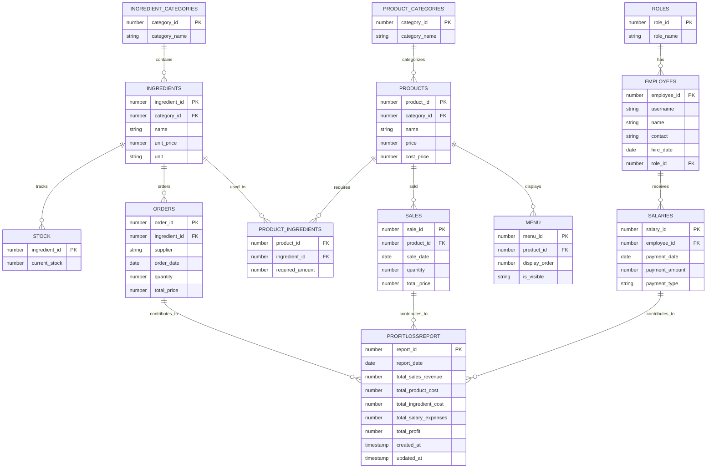

## **Database 설계 및 설정**


------

- ## 1. **테이블 구성**

  ### **1. 직급 테이블 (Roles)**

  | 컬럼명      | 데이터 타입 | 설명                                         |
  | ----------- | ----------- | -------------------------------------------- |
  | `role_id`   | INT (PK)    | 직급 ID, 각 직급을 구별하기 위한 고유 식별자 |
  | `role_name` | VARCHAR     | 직급명 (예: 크루, 리더, 매니저 등)           |

  **설명**:
  직급 테이블은 직원이 소속된 직급을 관리. 각 직급은 고유한 `role_id`로 식별되며, 이를 통해 직원의 역할을 관리하고 각 직급에 맞는 접근 권한을 설정할 수 있음.
  
  ------

  ### **2. 직원 테이블 (Employees)**

  | 컬럼명          | 데이터 타입 | 설명                           |
  | --------------- | ----------- | ------------------------------ |
  | `employee_id`   | INT (PK)    | 직원 ID, 각 직원의 고유 식별자 |
  | `username`      | VARCHAR     | 사용자명                       |
  | `password_hash` | VARCHAR     | 암호화된 비밀번호              |
  | `name`          | VARCHAR     | 직원 이름                      |
  | `contact`       | VARCHAR     | 직원 연락처                    |
  | `hire_date`     | DATETIME    | 입사 일자                      |
  | `role_id`       | INT (FK)    | 직급 ID                        |

  **설명**:
  직원 테이블은 시스템에 등록된 모든 직원의 기본 정보를 관리. `employee_id`를 통해 직원 개별 정보를 고유하게 식별하며, `role_id`는 해당 직원의 직급을 지정.

  ------

  ### **3. 급여 테이블 (Salaries)**

  | 컬럼명           | 데이터 타입 | 설명                        |
  | ---------------- | ----------- | --------------------------- |
  | `salary_id`      | INT (PK)    | 급여 ID                     |
  | `employee_id`    | INT (FK)    | 직원 ID                     |
  | `payment_date`   | DATETIME    | 급여 지급 날짜              |
  | `payment_amount` | DECIMAL     | 급여 지급액                 |
  | `payment_type`   | VARCHAR     | 급여 구분 (월급, 상여금 등) |

  **설명**:
  급여 테이블은 직원들에게 지급된 급여 내역을 기록. 각 급여는 고유한 `salary_id`로 식별되며, `employee_id`는 급여를 지급받은 직원을 참조.

  ------

  ### **4. 재료 카테고리 테이블 (Ingredient_Categories)**

  | 컬럼명          | 데이터 타입 | 설명               |
  | --------------- | ----------- | ------------------ |
  | `category_id`   | INT (PK)    | 재료 카테고리 ID   |
  | `category_name` | VARCHAR     | 재료 카테고리 이름 |

  **설명**:
  재료 카테고리 테이블은 다양한 재료를 카테고리별로 구분하여 관리. `category_id`는 고유한 카테고리 식별자로 사용. 예를 들어, '육류', '채소'와 같은 카테고리가 정의될 수 있음.

  ------

  ### **5. 재료 테이블 (Ingredients)**

  | 컬럼명          | 데이터 타입 | 설명             |
  | --------------- | ----------- | ---------------- |
  | `ingredient_id` | INT (PK)    | 재료 ID          |
  | `category_id`   | INT (FK)    | 재료 카테고리 ID |
  | `name`          | VARCHAR     | 재료명           |
  | `unit_price`    | DECIMAL     | 단가             |
  | `unit`          | VARCHAR     | 단위 (예: g, 개) |

  **설명**:
  재료 테이블은 매장에서 사용하는 모든 재료의 정보를 관리. 각 재료는 `ingredient_id`로 식별되며, `category_id`는 이 재료가 속하는 카테고리를 나타냄.

  ------

  ### **6. 주문 테이블 (Orders)**

  | 컬럼명          | 데이터 타입 | 설명         |
  | --------------- | ----------- | ------------ |
  | `order_id`      | INT (PK)    | 주문 ID      |
  | `ingredient_id` | INT (FK)    | 재료 ID      |
  | `supplier`      | VARCHAR     | 거래처       |
  | `order_date`    | DATETIME    | 주문 일시    |
  | `quantity`      | DECIMAL     | 주문 수량    |
  | `total_price`   | DECIMAL     | 총 주문 금액 |

  **설명**:
  주문 테이블은 재료의 발주 내역을 기록. 각 주문은 고유한 `order_id`로 식별되며, `ingredient_id`는 주문한 재료를 참조.

  ------

  ### **7. 재고 테이블 (Stock)**

  | 컬럼명          | 데이터 타입  | 설명        |
  | --------------- | ------------ | ----------- |
  | `ingredient_id` | INT (PK, FK) | 재료 ID     |
  | `current_stock` | DECIMAL      | 현재 재고량 |

  **설명**:
  재고 테이블은 각 재료의 현재 재고 수량을 추적. `ingredient_id`는 재료와 매핑되며, `current_stock`는 재료의 재고 수량을 나타냄.

  ------

  ### **8. 재고 기록 테이블 (Stock_Logs)**

  | 컬럼명          | 데이터 타입 | 설명                     |
  | --------------- | ----------- | ------------------------ |
  | `stock_log_id`  | INT (PK)    | 재고 기록 ID             |
  | `ingredient_id` | INT (FK)    | 재료 ID                  |
  | `change_amount` | DECIMAL     | 변화량                   |
  | `log_date`      | DATETIME    | 기록 날짜                |
  | `reason`        | VARCHAR     | 변화 사유 (판매/주문 등) |

  **설명**:
  재고 기록 테이블은 재고의 변화를 기록. 재고가 추가되거나 차감될 때마다 로그를 남겨 재고 관리의 투명성을 확보.

  ------

  ### **9. 상품 카테고리 테이블 (Product_Categories)**

  | 컬럼명          | 데이터 타입 | 설명               |
  | --------------- | ----------- | ------------------ |
  | `category_id`   | INT (PK)    | 상품 카테고리 ID   |
  | `category_name` | VARCHAR     | 상품 카테고리 이름 |

  **설명**:
  상품 카테고리 테이블은 판매되는 상품들을 카테고리별로 구분하여 관리. 예를 들어, '버거', '사이드', '음료'와 같은 카테고리를 설정할 수 있음.

  ------

  ### **10. 상품 테이블 (Products)**

  | 컬럼명        | 데이터 타입 | 설명             |
  | ------------- | ----------- | ---------------- |
  | `product_id`  | INT (PK)    | 상품 ID          |
  | `category_id` | INT (FK)    | 상품 카테고리 ID |
  | `name`        | VARCHAR     | 상품명           |
  | `price`       | DECIMAL     | 상품 가격        |
  | `cost_price`  | DECIMAL     | 원가             |

  **설명**:
  상품 테이블은 실제 판매되는 상품들의 정보를 기록. 각 상품은 고유한 `product_id`로 식별되며, `category_id`는 상품의 카테고리를 나타냄.

  ------

  ### **11. 상품_재료 매핑 테이블 (Product_Ingredients)**

  | 컬럼명            | 데이터 타입  | 설명    |
  | ----------------- | ------------ | ------- |
  | `product_id`      | INT (PK, FK) | 상품 ID |
  | `ingredient_id`   | INT (PK, FK) | 재료 ID |
  | `required_amount` | DECIMAL      | 소요량  |

  **설명**:
  상품과 재료를 연결하는 매핑 테이블로, 각 상품에 필요한 재료와 그 소요량을 기록.

  ------

  ### **12. 메뉴 테이블 (Menu)**

  | 컬럼명          | 데이터 타입 | 설명                                    |
  | --------------- | ----------- | --------------------------------------- |
  | `menu_id`       | NUMBER (PK) | Menu 테이블 고유 ID                     |
  | `product_id`    | NUMBER (FK) | Products 테이블의 상품 ID               |
  | `display_order` | NUMBER      | 메뉴판에서 상품 표시 순서               |
  | `is_visible`    | CHAR(1)     | 메뉴판 표시 여부 ('Y': 표시, 'N': 숨김) |

  **설명**:
  메뉴 테이블은 매장에서 제공되는 상품들을 메뉴판에 표시하기 위한 정보를 관리. 각 상품은 `product_id`로 참조되며, `is_visible` 컬럼을 통해 메뉴에 표시할지 여부를 제어할 수 있음.

  ------
  
   ### **13. 판매 테이블 (Sales)**

  | 컬럼명        | 데이터 타입 | 설명         |
  | ------------- | ----------- | ------------ |
  | `sale_id`     | INT (PK)    | 판매 ID      |
  | `product_id`  | INT (FK)    | 상품 ID      |
  | `sale_date`   | DATETIME    | 판매 일시    |
  | `quantity`    | INT         | 판매 수량    |
  | `total_price` | DECIMAL     | 총 판매 금액 |

  **설명**:
  판매 테이블은 매장에서 이루어진 상품 판매 내역을 관리. 각 판매는 고유한 `sale_id`로 식별되며, `product_id`는 판매된 상품을 참조.
 
  ------

  ### **14. 손익 보고서 테이블 (ProfitLossReport)**

  | 컬럼명                  | 데이터 타입 | 설명         |
  | ----------------------- | ----------- | ------------ |
  | `report_id`             | NUMBER (PK) | 보고서 ID    |
  | `report_date`           | DATE        | 보고서 날짜  |
  | `total_sales_revenue`   | NUMBER      | 총 판매 수익 |
  | `total_product_cost`    | NUMBER      | 총 상품 비용 |
  | `total_ingredient_cost` | NUMBER      | 총 재료 비용 |
  | `total_salary_expenses` | NUMBER      | 총 급여 비용 |
  | `total_profit`          | NUMBER      | 총 이익      |
  | `created_at`            | TIMESTAMP   | 생성 시간    |
  | `updated_at`            | TIMESTAMP   | 수정 시간    |

  **설명**:
  손익 보고서 테이블은 매장의 전반적인 재무 상태를 관리. `report_date`는 손익 보고서의 날짜를 나타내며, `total_sales_revenue`, `total_product_cost`, `total_ingredient_cost`, `total_salary_expenses` 등을 기반으로 `total_profit`을 계산.


------


## **2. 트리거 구성**

### **1. 직원 순차 등록 트리거**

**목적**: 직원 테이블에 새로운 직원이 추가될 때, `employee_id`를 자동으로 생성하기 위한 트리거. 
이 트리거는 `employee_id`가 제공되지 않았을 경우, 시퀀스를 사용하여 자동으로 ID를 할당.

```sql
-- 직원 테이블에 새 직원이 추가될 때 employee_id를 자동으로 생성하는 트리거
CREATE OR REPLACE TRIGGER employee_id_trigger
BEFORE INSERT ON Employees
FOR EACH ROW
BEGIN
    -- employee_id가 제공되지 않으면, 시퀀스를 사용하여 자동으로 값 할당
    IF :NEW.employee_id IS NULL THEN
        SELECT employee_id_seq.NEXTVAL
        INTO :NEW.employee_id
        FROM dual;
    END IF;
END;
/
```

**설명**:
- `employee_id`는 직원 고유 식별자로, 데이터 삽입 시 자동으로 생성.
- `employee_id_seq.NEXTVAL`을 사용하여 시퀀스에서 다음 값을 가져와 `employee_id`에 할당.

------

### **2. 판매 → 재고 감소 트리거 1 - 사전 체크**

**목적**: 판매가 이루어지기 전에, 판매할 상품에 필요한 재료가 충분한지 확인하는 트리거. 재고가 부족하면 판매를 진행할 수 없도록 함.

```sql
-- 판매 시 재고 부족을 사전에 체크하는 트리거
CREATE OR REPLACE TRIGGER check_stock_before_sale
BEFORE INSERT ON Sales
FOR EACH ROW
DECLARE
    insufficient_stock EXCEPTION;  -- 재고 부족 예외 처리
    current_stock NUMBER;          -- 현재 재고량 변수
BEGIN
    -- 판매되는 상품에 대한 재료가 충분한지 체크
    FOR r IN (
        SELECT ingredient_id, required_amount * :NEW.quantity AS total_required
        FROM Product_Ingredients
        WHERE product_id = :NEW.product_id
    ) LOOP
        -- 재료의 현재 재고를 조회
        SELECT current_stock
        INTO current_stock
        FROM Stock
        WHERE ingredient_id = r.ingredient_id;
        
        -- 재고가 부족하면 예외 발생
        IF current_stock < r.total_required THEN
            RAISE insufficient_stock;
        END IF;
    END LOOP;
EXCEPTION
    WHEN insufficient_stock THEN
        -- 재고 부족 시 판매를 처리할 수 없다는 오류 메시지 출력
        RAISE_APPLICATION_ERROR(-20001, '재고가 부족하여 판매를 처리할 수 없습니다.');
END;
/
```

**설명**:
- `check_stock_before_sale` 트리거는 판매가 진행되기 전에 각 재료의 재고가 충분한지 확인.
- 부족한 재료가 있을 경우, 판매를 중단하고 오류 메시지를 발생시킴.

------

### **3. 판매 → 재고 감소 트리거 2 - 사후 처리**

**목적**: 판매가 완료된 후, 재고 테이블의 수량을 차감하고, 재고 기록을 생성하는 트리거.

```sql
-- 판매 후 재고를 차감하고 재고 기록을 생성하는 트리거
CREATE OR REPLACE TRIGGER update_stock_after_sale
AFTER INSERT ON Sales
FOR EACH ROW
BEGIN
    -- 판매된 상품에 해당하는 재료의 재고를 차감
    FOR r IN (
        SELECT ingredient_id, required_amount * :NEW.quantity AS total_amount
        FROM Product_Ingredients
        WHERE product_id = :NEW.product_id
    ) LOOP
        -- 재고 차감
        UPDATE Stock
        SET current_stock = current_stock - r.total_amount
        WHERE ingredient_id = r.ingredient_id;
        
        -- 재고 변경 내역을 기록
        INSERT INTO Stock_Logs (stock_log_id, ingredient_id, change_amount, log_date, reason)
        VALUES (stock_log_seq.NEXTVAL, r.ingredient_id, -r.total_amount, SYSDATE, '판매로 인한 감소');
    END LOOP;
END;
/
```

**설명**:

- `update_stock_after_sale` 트리거는 판매가 완료된 후, 판매된 상품에 해당하는 재료의 재고를 차감하고, `Stock_Logs` 테이블에 변경 내역을 기록.
- `stock_log_seq.NEXTVAL`로 새로운 재고 기록 ID를 생성하여, 재고 변경 이력을 남김.

------

### **4. 재고 변경 시 기록 생성 트리거**

**목적**: 재고가 변경될 때마다 그 변화를 기록하는 트리거.

```sql
-- 재고가 변경될 때마다 변경 이력을 기록하는 트리거
CREATE OR REPLACE TRIGGER log_stock_changes
AFTER UPDATE ON Stock
FOR EACH ROW
BEGIN
    -- 재고 변경 이력 기록
    INSERT INTO Stock_Logs (stock_log_id, ingredient_id, change_amount, log_date, reason)
    VALUES (
        stock_log_seq.NEXTVAL,  -- 새로운 로그 ID 생성
        :NEW.ingredient_id,     -- 변경된 재료 ID
        :NEW.current_stock - :OLD.current_stock,  -- 변화량
        SYSDATE,                 -- 변경 일시
        '재고 수동 변경'         -- 변경 사유
    );
END;
/
```

**설명**:

- `log_stock_changes` 트리거는 `Stock` 테이블의 데이터가 업데이트될 때마다, 변경된 내용(`change_amount`)을 `Stock_Logs`에 기록.
- 수동으로 재고가 변경된 경우 그 사유를 '재고 수동 변경'으로 기록.

------

### **5. 재고 변경 시 음수 방지 트리거**

**목적**: 재고 수량이 음수가 되는 것을 방지하는 트리거.

```sql
-- 재고 수량이 음수가 되는 것을 방지하는 트리거
CREATE OR REPLACE TRIGGER prevent_negative_stock
BEFORE UPDATE ON Stock
FOR EACH ROW
BEGIN
    -- 재고가 음수로 업데이트되는 것을 방지
    IF :NEW.current_stock < 0 THEN
        RAISE_APPLICATION_ERROR(-20002, '재고는 0보다 작을 수 없습니다.');
    END IF;
END;
/
```

**설명**:

- `prevent_negative_stock` 트리거는 재고 수량이 음수로 업데이트되는 것을 방지.
- 재고가 0보다 적으면, 애플리케이션 오류를 발생시켜 이를 막음.

------

### **6. ingredient_id_trigger 트리거**

**목적**: 재료가 삽입될 때 `ingredient_id`를 자동으로 생성하는 트리거.

```sql
-- 새로운 재료가 삽입될 때 ingredient_id를 자동으로 생성하는 트리거
CREATE OR REPLACE TRIGGER ingredient_id_trigger
BEFORE INSERT ON Ingredients
FOR EACH ROW
BEGIN
    -- 재료 ID를 자동으로 생성
    :NEW.ingredient_id := ingredient_seq.NEXTVAL;
END;
/
```

**설명**:

- `ingredient_id_trigger` 트리거는 새로운 재료가 추가될 때 `ingredient_seq.NEXTVAL`을 사용하여 자동으로 `ingredient_id`를 할당.

------

### **7. menu_id_trigger 트리거**

**목적**: 메뉴 테이블에 새로운 메뉴 항목이 추가될 때, `menu_id`를 자동으로 생성하는 트리거.

```sql
-- 새로운 메뉴가 추가될 때 menu_id를 자동으로 생성하는 트리거
CREATE OR REPLACE TRIGGER menu_id_trigger
BEFORE INSERT ON Menu
FOR EACH ROW
BEGIN
    -- 메뉴 ID를 자동으로 생성
    :NEW.menu_id := menu_seq.NEXTVAL;
END;
/
```

**설명**:

- `menu_id_trigger` 트리거는 메뉴 항목이 추가될 때마다 `menu_seq.NEXTVAL`을 사용하여 자동으로 `menu_id`를 할당.

------

### **8. Products 테이블 삭제 시 메뉴 숨김 처리 트리거**

**목적**: `Products` 테이블에서 상품이 삭제되면, 해당 상품이 메뉴에서 숨겨지도록 하는 트리거.

```sql
-- 상품 삭제 시 해당 상품을 메뉴에서 숨기는 트리거
CREATE OR REPLACE TRIGGER hide_menu_on_product_delete
BEFORE DELETE ON Products
FOR EACH ROW
BEGIN
    -- 삭제된 상품이 메뉴에서 숨김 처리되도록 업데이트
    UPDATE Menu
    SET is_visible = 'N'
    WHERE product_id = :OLD.product_id;
END;
/
```

**설명**:

- `hide_menu_on_product_delete` 트리거는 `Products` 테이블에서 상품이 삭제될 때, 해당 상품이 메뉴에서 숨겨지도록 처리.
- `is_visible = 'N'`으로 메뉴에서 해당 상품을 표시하지 않도록 설정.

------

### **9. 손익계산서 처리 트리거**

**목적**: `ProfitLossReport` 테이블에 손익 계산서가 삽입될 때, 자동으로 `report_id`를 생성하는 트리거.

```sql
-- 손익 계산서에 보고서 ID를 자동으로 생성하는 트리거
CREATE OR REPLACE TRIGGER trg_profit_loss_report
BEFORE INSERT ON ProfitLossReport
FOR EACH ROW
BEGIN
    -- 손익 보고서 ID를 시퀀스를 사용하여 자동 생성
    :new.REPORT_ID := profit_loss_report_seq.NEXTVAL;
END;
/
```

**설명**:

- `trg_profit_loss_report` 트리거는 손익 보고서가 생성될 때마다 `profit_loss_report_seq.NEXTVAL`을 사용하여 자동으로 `report_id`를 생성.


## 3. **테이블 개선사항**
기존 테이블은 현재 시스템에서 기본적인 기능을 수행하고 있지만, 데이터베이스의 전반적인 품질과 성능을 높이기 위해 몇 가지 중요한 개선 여지가 있다. 
이러한 개선은 **효율성**, **안정성**, **확장성** 측면에서 접근할 수 있고, 이를 통해 시스템의 성능과 데이터 무결성을 높이며, 향후 확장에 대한 유연성을 확보할 수 있다.

### 3.1 데이터 무결성 강화

#### 제약 조건 추가
- 데이터의 정확성과 일관성을 보장하기 위해 필수 입력 필드, 유효한 데이터 범위, 외래 키 참조 등을 명확히 정의하여 잘못된 데이터 입력을 사전에 방지.

1. **직원 테이블 (Employees)**
```sql
-- 사용자명 중복 방지
ALTER TABLE Employees
ADD CONSTRAINT unique_username UNIQUE (username);

-- 전화번호 형식 검증
ALTER TABLE Employees
ADD CONSTRAINT chk_contact 
CHECK (REGEXP_LIKE(contact, '^\d{3}-\d{3}-\d{4}$'));

-- 이메일 형식 검증
ALTER TABLE Employees
ADD CONSTRAINT chk_email 
CHECK (email LIKE '%@%.%');
```

2. **재료 테이블 (Ingredients)**
```sql
-- 재료명 필수 입력 및 가격 음수 방지
ALTER TABLE Ingredients
MODIFY name NOT NULL;

ALTER TABLE Ingredients
ADD CONSTRAINT chk_unit_price 
CHECK (unit_price >= 0);
```

#### 데이터 형식 검증
- 각 컬럼의 데이터 타입과 길이를 엄격하게 관리하여 데이터의 일관성을 유지.
- 정규식(Regex) 또는 체크 제약 조건을 활용하여 입력 데이터의 형식을 검증.

3. **주문 테이블 (Orders)**
```sql
-- 주문 상태 제한
ALTER TABLE Orders
ADD CONSTRAINT chk_order_status 
CHECK (status IN ('pending', 'processing', 'completed', 'cancelled'));

-- 주문 날짜 범위 제한
ALTER TABLE Orders
ADD CONSTRAINT chk_order_date 
CHECK (order_date BETWEEN '2020-01-01' AND CURRENT_DATE);
```
------

### 3.2 성능 최적화

#### 인덱스 최적화
- 자주 검색되거나 조인되는 컬럼에 대해 적절한 인덱스를 생성하여 쿼리 성능을 향상.
- 복합 인덱스와 부분 인덱스 등 고급 인덱싱 기법을 적용하여 검색 속도를 개선.

1. **판매 테이블 (Sales)**
```sql
-- 복합 인덱스 생성
CREATE INDEX idx_sales_product_date 
ON Sales(product_id, sale_date);


-- 부분 인덱스 생성 (특정 조건의 데이터만 인덱싱)
CREATE INDEX idx_high_value_sales 
ON Sales(sale_id, total_amount) 
WHERE total_amount > 1000;
```

2. **재고 테이블 (Stock)**
```sql
-- 인덱스 최적화
CREATE INDEX idx_stock_ingredient_current 
ON Stock(ingredient_id, current_stock);

```

#### 파티셔닝 전략
- 대규모 테이블의 경우 데이터를 논리적으로 분할하여 관리의 효율성을 높입니다.
- 시간, 범주, 해시 등 다양한 파티셔닝 방법을 고려하여 데이터 관리와 성능을 최적화합니다.

3. **Stock_Logs 테이블 (시간 기반 파티셔닝)**
```sql
-- 월별 파티셔닝
CREATE TABLE Stock_Logs (
    stock_log_id INT,
    ingredient_id INT,
    change_amount DECIMAL,
    log_date DATE
) 
PARTITION BY RANGE (MONTH(log_date)) (
    PARTITION p1 VALUES LESS THAN (2),
    PARTITION p2 VALUES LESS THAN (3),
    PARTITION p3 VALUES LESS THAN (4),
    PARTITION p4 VALUES LESS THAN (5)
);
```

------

### 3.3 확장성 고려

#### 스키마 유연성
- 향후 비즈니스 요구사항 변화에 대응할 수 있도록 테이블 구조의 유연성을 확보다.
- JSON 또는 JSONB 타입을 활용하여 동적 속성을 저장할 수 있는 공간을 마련.

1. **상품 테이블 (Products)**
```sql
-- JSON 필드 추가로 동적 속성 지원
ALTER TABLE Products
ADD COLUMN additional_info CLOB;


-- JSON 데이터 삽입 예시
INSERT INTO Products (name, price, additional_info)
VALUES ('특별 상품', 10000, 
    '{"origin": "국내산", "storage_method": "냉장보관", "allergy_info": ["밀", "우유"]}');
```

#### 히스토리 추적
- 데이터 변경 이력을 추적할 수 있는 메커니즘을 도입하여 감사 추적성을 확보.
- 타임스탬프, 변경 로그 등을 통해 데이터의 변경 내역을 관리.

2. **변경 이력 추적 테이블 생성**
```sql
-- 감사 로그 테이블 생성
CREATE TABLE Audit_Log (
    log_id SERIAL PRIMARY KEY,
    table_name VARCHAR(50),
    record_id INT,
    column_name VARCHAR(50),
    old_value TEXT,
    new_value TEXT,
    changed_by VARCHAR(100),
    changed_at TIMESTAMP DEFAULT CURRENT_TIMESTAMP
);

-- 트리거 예시 (Oracle DB 문법)
CREATE OR REPLACE TRIGGER log_changes
AFTER UPDATE ON SomeTable
FOR EACH ROW
BEGIN
    INSERT INTO Audit_Log
    (table_name, record_id, column_name, old_value, new_value, changed_by)
    VALUES
    ('SomeTable', :NEW.id, 'column_name', :OLD.column_name, :NEW.column_name, USER);
END;
/
```

------

이러한 개선 사항들은 데이터베이스의 무결성, 성능, 확장성을 크게 향상시킬 수 있음.


## 4. **트리거 개선사항**

기존에 정의된 트리거들은 기본적인 비즈니스 로직을 처리하는 데에 충분히 효과적이지만, 시스템의 성능, 안정성, 유지보수성을 높이기 위해 몇 가지 개선 할 수 있다.
이 개선사항들은 주로 트리거의 성능 최적화, 예외 처리 강화, 그리고 데이터 무결성 유지 측면에서 유용하게 작용할 것으로 예상.

### 4.1 **트리거 성능 개선**

#### 1. **불필요한 `FOR` 루프 제거**
- `FOR` 루프는 데이터의 양이 많을 경우 성능 저하를 일으킬 수 있음. 예를 들어, 재고 감소 트리거에서 `FOR` 루프를 사용하여 `Product_Ingredients` 테이블에서 모든 재료를 가져오는 방식은 비효율적일 수 있음. 
이를 개선하기 위해 집합 기반 작업을 사용하는 방법을 고려할 수 있음.

```sql
-- 개선된 판매 → 재고 감소 트리거 (사전 체크) 
CREATE OR REPLACE TRIGGER check_stock_before_sale
BEFORE INSERT ON Sales
FOR EACH ROW
DECLARE
    insufficient_stock EXCEPTION;
    current_stock NUMBER;
BEGIN
    -- 직접 하나의 쿼리로 재고 확인
    SELECT current_stock
    INTO current_stock
    FROM Stock
    WHERE ingredient_id IN (SELECT ingredient_id 
                             FROM Product_Ingredients 
                             WHERE product_id = :NEW.product_id)
    HAVING current_stock < (SELECT required_amount * :NEW.quantity 
                            FROM Product_Ingredients 
                            WHERE product_id = :NEW.product_id);
    
    IF current_stock < 0 THEN
        RAISE insufficient_stock;
    END IF;
EXCEPTION
    WHEN insufficient_stock THEN
        RAISE_APPLICATION_ERROR(-20001, '재고가 부족하여 판매를 처리할 수 없습니다.');
END;
/
```

#### 2. **AFTER 트리거에서의 복잡한 업데이트 최적화**
- `AFTER` 트리거에서 여러 테이블을 업데이트하는 과정은 종종 비효율적일 수 있음. 이러한 경우, 트리거에서 여러 개의 `UPDATE`를 동시에 처리하기보다는 한 번에 처리할 수 있도록 집합적 방법을 고려해야 함.

```sql
-- 개선된 판매 → 재고 감소 트리거 (사후 처리)
CREATE OR REPLACE TRIGGER update_stock_after_sale
AFTER INSERT ON Sales
FOR EACH ROW
BEGIN
    -- 한 번에 여러 재고를 차감
    UPDATE Stock
    SET current_stock = current_stock - (SELECT required_amount * :NEW.quantity 
                                          FROM Product_Ingredients
                                          WHERE product_id = :NEW.product_id)
    WHERE ingredient_id IN (SELECT ingredient_id 
                             FROM Product_Ingredients 
                             WHERE product_id = :NEW.product_id);
    
    INSERT INTO Stock_Logs (stock_log_id, ingredient_id, change_amount, log_date, reason)
    SELECT stock_log_seq.NEXTVAL, ingredient_id, -total_amount, SYSDATE, '판매로 인한 감소'
    FROM (SELECT ingredient_id, required_amount * :NEW.quantity AS total_amount
          FROM Product_Ingredients
          WHERE product_id = :NEW.product_id);
END;
/
```

### 4.2 **예외 처리 및 오류 메시지 강화**

#### 1. **명확한 오류 메시지 추가**
- 오류 발생 시, 사용자나 시스템 관리자가 원인을 명확히 알 수 있도록 더 구체적이고 친절한 오류 메시지를 제공하는 것이 좋음.

```sql
-- 개선된 판매 → 재고 감소 트리거 (사전 체크)
CREATE OR REPLACE TRIGGER check_stock_before_sale
BEFORE INSERT ON Sales
FOR EACH ROW
DECLARE
    insufficient_stock EXCEPTION;
    current_stock NUMBER;
BEGIN
    -- 재고 부족 여부 체크
    SELECT current_stock
    INTO current_stock
    FROM Stock
    WHERE ingredient_id = :NEW.ingredient_id;
    
    IF current_stock < :NEW.quantity THEN
        RAISE insufficient_stock;
    END IF;
EXCEPTION
    WHEN insufficient_stock THEN
        -- 구체적이고 친절한 오류 메시지 출력
        RAISE_APPLICATION_ERROR(-20001, 
            '판매를 처리할 수 없습니다. 재고가 부족합니다. 재고 현황: ' || current_stock || '개');
END;
/
```

### 4.3 **데이터 무결성 및 규칙 강화**

#### 1. **일관성 있는 트리거 적용**
- `BEFORE`와 `AFTER` 트리거가 상호 보완적으로 잘 작동하도록, 모든 트리거가 데이터의 일관성과 무결성을 보장하도록 함. 
예를 들어, 재고 변경 시 기록을 남기는 `AFTER` 트리거와 재고 수량을 음수로 방지하는 `BEFORE` 트리거를 적절히 결합하여 데이터의 정확성을 유지할 수 있음.

```sql
-- 개선된 재고 변경 시 음수 방지 트리거
CREATE OR REPLACE TRIGGER prevent_negative_stock
BEFORE UPDATE ON Stock
FOR EACH ROW
BEGIN
    IF :NEW.current_stock < 0 THEN
        RAISE_APPLICATION_ERROR(-20002, '재고는 0보다 작을 수 없습니다. 현재 재고: ' || :NEW.current_stock);
    END IF;
END;
/
```

### 4.4 **트리거 효율성 및 유지보수성 강화**

#### 1. **트리거 함수화**
- 복잡한 로직을 트리거 내부에서 직접 처리하는 대신, 트리거 외부에서 함수를 호출하는 방식으로 로직을 분리하여 유지보수성을 높이고, 필요 시 재사용할 수 있도록 함.

```sql
-- 트리거 함수화 (재고 차감 처리)
CREATE OR REPLACE FUNCTION update_stock_after_sale_func(p_product_id INT, p_quantity INT)
RETURN VOID IS
BEGIN
    UPDATE Stock
    SET current_stock = current_stock - p_quantity
    WHERE ingredient_id IN (SELECT ingredient_id 
                             FROM Product_Ingredients 
                             WHERE product_id = p_product_id);
END;
/

-- 트리거에서 함수 호출
CREATE OR REPLACE TRIGGER update_stock_after_sale
AFTER INSERT ON Sales
FOR EACH ROW
BEGIN
    -- 트리거 함수 호출
    update_stock_after_sale_func(:NEW.product_id, :NEW.quantity);
    INSERT INTO Stock_Logs (stock_log_id, ingredient_id, change_amount, log_date, reason)
    VALUES (stock_log_seq.NEXTVAL, :NEW.product_id, -:NEW.quantity, SYSDATE, '판매로 인한 감소');
END;
/
```

## **결론**
기존 데이터베이스 설계는 시스템의 기본적인 기능을 효과적으로 수행할 수 있는 구조를 갖추고 있음. 
그러나 성능 최적화, 예외 처리 강화, 데이터 무결성 강화 등의 개선을 통해 더 높은 수준의 안정성, 효율성, 확장성을 구현할 수 있음. 
예를 들어, 불필요한 반복문 제거, 트리거 업데이트 최적화, 추가적인 제약 조건 적용 등으로 시스템의 성능을 개선하고, 향후 확장에 대비할 수 있음. 
이러한 개선사항들은 데이터베이스가 더욱 안정적이고 효율적으로 운영되도록 돕는 중요한 역할을 할 것이다.
