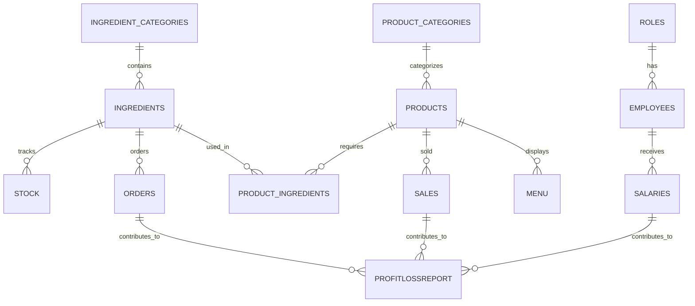

# 매장 관리 프로그램

## 1. 개요

### 1.1 프로젝트 설명

**프로젝트 이름**: 매장 관리 프로그램

**목적**: 소규모 사업장에서 상품, 재고, 판매, 주문, 직원 관리 등을 효율적으로 지원하는 프로그램을 개발.

**개발 환경 및 사용 기술**:

- **언어**: Java Development Kit (JDK) 17
- **데이터베이스**: Oracle Database


## 2. 주요 기능

### 2.1 로그인/직원 등록

- **로그인 기능**: 직원은 ID와 비밀번호를 사용하여 시스템에 로그인. 로그인 후 직급에 따라 접근 가능한 메뉴가 다름.
- **직원 등록 기능**: 신규 직원을 등록할 수 있음. 기본 정보를 입력.

### 2.2 상품 관리 (상품 판매 및 판매 메뉴 설정 기능)

- **상품 판매**: 포스기 스타일의 UI를 통해 상품을 선택하고, 수량을 입력하여 판매. 결제 후 판매 내역이 기록됨.
- **판매 메뉴 설정**: 관리자는 메뉴에 추가할 상품을 등록하고, 메뉴의 표시 여부를 설정할 수 있음.

### 2.3 재고 및 주문 관리

- **재고 관리**: 재료별로 재고를 실시간으로 확인하고, 주문 내역을 관리.
- **주문 관리**: 재료를 주문하고, 주문 내역과 총액을 기록.

### 2.4 관리자 메뉴 (재료 등록, 상품 등록, 직원 관리)

- **재료 등록**: 관리자만 가능하며, 재료의 카테고리와 함께 사용 될 재료를 등록.
- **상품 등록**: 상품에 추가되는 재료와 가격을 관리하고, 상품의 정보를 수정 및 삭제할 수 있음.
- **직원 관리**: 직원의 정보를 수정하고 급여를 지급하는 기능 포함. 직급에 따른 권한 관리도 이루어짐.

### 2.5 보고서 (주문내역, 판매내역, 급여지급내역, 손익계산서)

- **주문내역**: 월별 또는 날짜별 주문 내역을 확인할 수 있음.
- **판매내역**: 판매된 상품과 수량, 총 판매 금액을 기록.
- **급여 지급 내역**: 직원들의 급여 지급 기록을 관리.
- **손익계산서**: 매출, 비용, 이익을 계산하여 손익을 확인할 수 있는 보고서를 생성.

### 2.6 복구

- **복구기능**: 료, 상품, 직원 정보를 삭제 한 경우 다시 복구 할 수 있음.

------

## 3. UI/UX 설계

### 3.1 대시보드

- **로그인 화면**: 애플리케이션 실행 시 **로그인/직원 등록** 화면 표시. 로그인 후 **로비 화면**으로 이동.
- **로비 화면**: 상단 메뉴바와 주요 기능(판매, 상품 관리, 재고 및 주문 관리, 관리자 메뉴)으로 빠르게 이동할 수 있는 버튼 포함.
- **상단 메뉴바**: 홈, 로그아웃, 시스템 종료, 인쇄, 도움말 등 시스템 기능에 접근.

### 3.2 직관적 인터페이스

- **판매 메뉴**: 상품 선택 후 장바구니에 담아 결제. 결제 후 판매 내역 실시간 반영.
- **상품 관리 메뉴**: 판매 메뉴에 노출될 상품 관리. 표시/숨기기 체크박스, 상품 정보 추가/수정 기능 포함.
- **재고 및 주문 메뉴**: 재고 현황 실시간 표시. 재고 부족 시 자동 주문 기능 제공.

### 3.3 관리자 메뉴

- **재료 등록**: 매장에 필요한 재료 등록 및 관리.
- **상품 등록**: 상품 등록 및 재료 연결을 통한 상품 구성.
- **직원 관리**: 직원 정보 수정, 급여 지급 및 관리.
- **보고서**: 판매, 주문, 급여 지급 내역 및 손익 계산서 제공.
- **복구 기능**: 삭제(비활성화)된 재료, 상품, 직원 목록 복구. 선택한 항목을 다시 활성화.

------

### 4. 데이터베이스 설계

#### 4.1 ER 다이어그램



#### 4.2 주요 테이블 설명

1. **직급 테이블 (Roles)**: 직원의 직급 정보 관리 (예: 크루, 리더, 매니저 등)
2. **직원 테이블 (Employees)**: 직원의 기본 정보와 직급 관리
3. **급여 테이블 (Salaries)**: 직원 급여 지급 내역 관리
4. **재료 카테고리 테이블 (Ingredient_Categories)**: 재료를 카테고리별로 구분하여 관리
5. **재료 테이블 (Ingredients)**: 재료의 상세 정보 관리 (이름, 가격, 단위 등)
6. **주문 테이블 (Orders)**: 재료의 발주 및 주문 내역 기록
7. **재고 테이블 (Stock)**: 각 재료의 재고 수량 추적
8. **상품 카테고리 테이블 (Product_Categories)**: 상품을 카테고리별로 관리 (예: 버거, 음료, 사이드 등)
9. **상품 테이블 (Products)**: 판매되는 상품의 기본 정보 (가격, 이름 등) 관리
10. **상품_재료 매핑 테이블 (Product_Ingredients)**: 상품에 필요한 재료와 소요량 관리
11. **메뉴 테이블 (Menu)**: 메뉴에 표시될 상품과 표시 여부 관리
12. **판매 테이블 (Sales)**: 상품 판매 내역 기록
13. **손익 보고서 테이블 (ProfitLossReport)**: 매장의 손익 계산서 및 재무 현황 관리

-----

## 5. 폴더 구조

### 5.1 폴더 구조 설명

```bash
src/                  # 전체 소스 코드 디렉토리
 ├── db/              # 데이터베이스 연결 및 관련 클래스
 │   ├── DatabaseService.java  # 데이터베이스 서비스 클래스
 │   ├── DBConnection.java    # DB 연결 관리 클래스
 │   └── DBConnectionTest.java # DB 연결 테스트 클래스
 ├── model/           # 데이터 모델 관련 클래스
 │   ├── Category.java            # 카테고리 모델
 │   ├── Employee.java           # 직원 모델
 │   ├── Ingredient.java         # 재료 모델
 │   ├── IngredientCategory.java # 재료 카테고리 모델
 │   ├── MenuItem.java           # 메뉴 아이템 모델
 │   ├── Product.java            # 상품 모델
 │   ├── ProductCategory.java    # 상품 카테고리 모델
 │   ├── ProductIngredient.java  # 상품 재료 모델
 │   ├── Report.java             # 보고서 모델
 │   ├── Role.java               # 직급 모델
 │   ├── Salary.java             # 급여 모델
 │   └── Stock.java              # 재고 모델
 ├── service/          # 비즈니스 로직 및 DB 연동 클래스
 │   ├── CategoryDAO.java        # 카테고리 데이터 연동 클래스
 │   ├── EmployeeDAO.java        # 직원 데이터 연동 클래스
 │   ├── IngredientCategoryDAO.java # 재료 카테고리 데이터 연동 클래스
 │   ├── IngredientDAO.java     # 재료 데이터 연동 클래스
 │   ├── MenuDAO.java           # 메뉴 데이터 연동 클래스
 │   ├── OrderDAO.java          # 주문 데이터 연동 클래스
 │   ├── ProductCategoryDAO.java # 상품 카테고리 데이터 연동 클래스
 │   ├── ProductDAO.java        # 상품 데이터 연동 클래스
 │   ├── ProductIngredientDAO.java # 상품 재료 데이터 연동 클래스
 │   ├── ReportDAO.java         # 보고서 데이터 연동 클래스
 │   ├── RoleDAO.java           # 직급 데이터 연동 클래스
 │   ├── SalaryDAO.java         # 급여 데이터 연동 클래스
 │   └── StockDAO.java          # 재고 데이터 연동 클래스
 ├── ui/               # 사용자 인터페이스(UI) 관련 클래스
 │   ├── inventory/     # 재고 관리 관련 UI
 │   │   └── InventoryUI.java   # 재고 관리 화면
 │   ├── login/         # 로그인 관련 UI
 │   │   ├── LoginUI.java       # 로그인 화면
 │   │   └── RegisterUI.java    # 회원가입 화면
 │   ├── manager/       # 관리자 관련 UI
 │   │   ├── EmployeesManagementUI.java # 직원 관리 화면
 │   │   ├── ManagerUI.java         # 관리자 대시보드 화면
 │   │   ├── ProfitLossUI.java     # 손익 계산서 화면
 │   │   ├── RecoveryUI.java       # 데이터 복구 화면
 │   │   ├── RegisterIngredientUI.java # 재료 등록 화면
 │   │   └── RegisterProductUI.java   # 상품 등록 화면
 │   ├── sales/         # 판매 관련 UI
 │   │   ├── ProductManagementUI.java  # 상품 관리 화면
 │   │   ├── SalesUI.java            # 판매 화면
 │   │   └── EventManager.java       # 이벤트 관리 클래스
 │   ├── LobbyUI.java    # 로비 화면 UI
 │   └── MainUI.java     # 프로그램 시작 화면(UI)
 ├── config/            # 설정 파일들
 └── utils/             # 유틸리티 클래스
```

### 5.2 주요 클래스 설명

- **MainUI.java**: 프로그램의 시작 화면을 담당하며, 로그인 화면과 기본 메뉴로의 전환을 관리.
- **LoginUI.java**: 사용자 로그인 화면을 담당.
- **RegisterUI.java**: 신규 사용자 회원가입 화면을 담당.
- **InventoryUI.java**: 재고 관리 화면을 담당하며, 재고 현황과 주문 상태를 실시간으로 확인하고 관리.
- **EmployeesManagementUI.java**: 직원 관리 화면으로, 직원 등록, 수정, 삭제 및 급여 지급 기능을 제공.
- **ManagerUI.java**: 관리자 대시보드 화면으로, 다양한 관리 기능을 제공하며, 재료 등록, 상품 등록, 직원 관리 등을 관리.
- **ProductManagementUI.java**: 상품 관리 화면으로, 판매될 상품을 등록, 수정, 삭제할 수 있음.
- **SalesUI.java**: 판매 화면으로, 상품을 선택하고 결제할 수 있는 기능을 제공.
- **ProfitLossUI.java**: 손익 계산서를 관리하는 화면을 담당.
- **RecoveryUI.java**: 비활성화된 데이터(재료, 상품, 직원)를 복구할 수 있는 화면.
- **EventManager.java**: 이벤트 관리를 담당하며, 시스템 내에서 발생한 이벤트를 처리.
- **LobbyUI.java**: 로비 화면으로, 사용자가 다양한 메뉴로 이동할 수 있도록 돕는 버튼을 제공.

------

## 6. 향후 확장 가능성

### 6.1 직원 관리 기능 확장

- **직원 성과 관리**: 직원들의 근무 성과를 기록하고 평가하여, 성과 기반의 승진과 보상 시스템을 구축.
- **근태 관리 시스템**: 출퇴근 기록과 휴가/병가 관리 기능을 추가하여, 직원의 근태를 자동으로 기록하고 효율적으로 관리.
\> **예시**: 성과 기반 승진 관리, 휴가/병가 관리 기능을 추가하여 직원들의 근로 상황을 세밀하게 관리.

#### 6.2 키오스크 시스템 도입

- **목표**: 고객이 매장에서 직접 주문 및 결제할 수 있는 키오스크 시스템을 도입하여, 직원의 업무 부담을 줄이고 대기 시간을 단축.
- **기능**:
  - **주문 기능**: 고객이 메뉴를 선택하고, 필요한 옵션을 조정한 후 직접 주문을 완료.
  - **결제 시스템**: 카드, 현금 등 다양한 결제 방식 지원. 결제 후 주문 내역은 즉시 주방과 판매 시스템에 반영.
  - **효율성**: 대기 시간 단축과 업무 효율성 향상.
\> **예시**: 다양한 결제 방식 및 언어 지원을 추가하여, 해외 고객도 손쉽게 주문할 수 있도록 확장 가능.

#### 6.3 알림 시스템 확장

- **목표**: 재고 부족, 판매 알림, 급여 지급 등 중요한 사항들을 실시간으로 알려주는 알림 시스템 추가.
- **기능**: 재고 부족이나 판매 급증 시 관리자에게 알림을 보내 빠르게 대응할 수 있도록 지원.
\> **예시**: SMS 알림과 푸시 알림을 통해 사용자가 시스템의 변화를 실시간으로 확인할 수 있도록 확장 가능.

#### 6.4 보안 기능 강화

- **2단계 인증**: 사용자 인증의 보안성을 강화.
- **계정 잠금 기능**: 로그인 실패 시 계정 잠금을 통해 보안을 강화.
\> **예시**: IP 제한 및 다양한 보안 설정을 통해 고도화된 보안 시스템 구축.

#### 6.5 손익 분석 및 보고서 자동화

- **목표**: 손익 계산서, 매출 보고서, 주문 내역 분석 등을 자동으로 생성하고 분석하는 시스템 추가.
- **기능**: 보고서 자동화 기능을 통해 매출, 비용, 수익을 쉽게 파악하고, 상황에 맞는 의사결정을 빠르게 내릴 수 있도록 지원.
\> **예시**: 자동화된 보고서 시스템을 통해 매출 추이, 비용 분석 등을 실시간으로 관리하여 경영에 도움이 되는 기능 추가 가능.

**확장 가능성**: 기존 애플리케이션에 추가로 위의 모듈들을 통해 더욱 향상된 기능과 확장성이 가능함.

------
## **마치며**
본 매장 관리 프로그램은 소규모 사업장에서의 효율적인 상품, 재고, 판매, 주문, 직원 관리를 지원하며, 향후 다양한 확장 기능을 통해 더 많은 비즈니스 요구를 충족할 수 있는 가능성을 제공.
